# Product Requirements Document: IFGF Church Member and Activity Management

**Version:** 2.5

**Date:** 2026-08-08

**Status:** Engineering handoff draft

**Owner:** Ian Joseph Chandra

**Target repository:** `church-cms-laravel`, branch `codex-PRD`

**Production release branch:** protected `deploy`, promoted from an exact approved `ifgf/main` commit

**Source baseline:** ChurchCMS upstream commit `d12c110967fadbaa97fb2a108b71dd820a42e7ad` from 2026-08-07, Laravel 10, PHP 8.2+, MySQL, MIT license

**Production baseline gate:** Laravel 10 is no longer security-supported. Phase 0 must upgrade the source to the newest stable Laravel major and a supported PHP pair before feature delivery. As of this PRD date, the target is Laravel 13 with PHP 8.3 through 8.5, subject to the compatibility spike in Phase 0. MySQL 8.0 reached end of life in April 2026; production targets MySQL 8.4 LTS.
**Scope of this branch:** Documentation only. No application implementation is authorized by this PRD task.

---

## 1. Executive Summary

IFGF Taipei and Zhongli currently has three overlapping systems:

1. A Google Apps Script solution for member registration, birthday synchronization, QR generation, email delivery, and Sunday attendance.
2. A React and FastAPI administration system for members, generic activities, attendance, iCare, COME–GROW–SERVE–LEAD discipleship, ministries, reports, and role-based access.
3. ChurchCMS, a Laravel application that already provides member profiles, events, groups, permissions, membership cards, QR attendance sessions, galleries, notifications, exports, and audit logging.

The target product is one mobile-friendly Laravel and MySQL system that preserves all valuable behavior from the first two systems while reusing ChurchCMS wherever practical. It must support recurring and one-off church activities, iCare rosters and attendance, online Worship Night attendance, discipleship cohorts, ministries, birthday synchronization to Google Calendar, and a future event registration and ticketing capability.

The architecture must favor extension over duplication while keeping the fork mergeable with ChurchCMS upstream. Upstream-owned models remain the platform identity and compatibility layer. IFGF-specific behavior lives in an auto-discovered internal Composer package with its own routes, services, migrations, views, and tests. Additive sidecar tables hold IFGF-specific state where changing an upstream table or controller would create a recurring merge hotspot. All church activities still use one logical event and occurrence model. Attendance uses one logical record model with separate status, participation mode, and capture method. iCare and discipleship use domain-specific enrollment models while sharing the same occurrence and attendance engine.

### 1.1 Product goals

1. Replace Google Forms, Google Sheets, and Apps Script as the operational source of truth.
2. Replace the separate IFGF React and FastAPI administration system with Laravel modules.
3. Preserve the historical member and attendance data in `Jemaat & Absensi (2).xlsx`.
4. Give leaders fast mobile workflows during services and small-group meetings.
5. Retain the useful ChurchCMS modules and avoid rebuilding existing capabilities.
6. Make self-hosting and Indonesian commercial hosting straightforward.
7. Prepare clean extension points for photo-assisted attendance and event ticketing.
8. Keep the upstream delta small, documented, continuously merge-tested, and suitable for contributing generic improvements back to ChurchCMS.
9. Support a separately deployed church entrance device that can recognize consenting members locally and submit secure, auditable attendance decisions without making the Laravel website host computer-vision workloads.
10. Store profile pictures and attendance media in portable private object storage rather than MySQL blobs or public web directories.

### 1.2 Non-goals for the first production release

1. Unsupervised automatic face attendance before the Phase 2 shadow, accuracy, liveness, privacy, security, and pastoral gates pass.
2. Payment processing and paid ticket sales.
3. Replacement of the public church website, sermons, donations, or prayer modules.
4. Native iOS or Android application development.
5. Bi-directional synchronization of all Google Calendar events.

### 1.3 Success measures

| Measure | Acceptance target |
|---|---|
| Member migration | Every non-empty source row is imported or appears in a reviewed exception report |
| Attendance reconciliation | Weekly totals per branch reconcile to the source workbook, with documented exceptions |
| Sunday check-in | A trained leader completes QR or manual check-in in at most 10 seconds per member |
| iCare workflow | A leader records and finalizes a normal weekly roster on a 360px-wide phone in at most 2 minutes |
| CGSL workflow | Administrators can create a cohort, enroll members and teachers, schedule lessons, and record weekly attendance |
| Birthday synchronization | Create, update, deactivate, and repair operations are idempotent and do not produce duplicate birthday series |
| Mobile quality | No horizontal scrolling in check-in, iCare, CGSL, and member portal flows at 360px width |
| Recoverability | A documented restore drill meets RPO 24 hours and RTO 4 hours |
| Supported platform | Production runs on a Laravel and PHP pair receiving upstream security fixes |
| Privacy readiness | The MVP data-flow and privacy-impact review is approved before real member data enters production |
| Upstream mergeability | Weekly and work-package-boundary merge rehearsals against the recorded `upstream/main` pass, and every upstream-owned file change appears in the compatibility ledger |
| Profile media | Private profile-picture upload, processing, replacement, signed delivery, deletion, and restore work with no public object URLs or personal data in object keys |
| Edge recognition | The entrance device continues safely through a temporary WAN outage, submits idempotent events after recovery, and never recognizes or stores an event for a member without active biometric consent |
| Automatic face attendance | Four consecutive representative shadow services and at least 500 opportunities pass field usability with zero confirmed false identities; a separate statistically powered evaluation demonstrates an approved one-sided 95% false-identification upper bound, initially no greater than 1 in 10,000 opportunities, before automatic mode |

---

## 2. Evidence and Existing-System Inventory

This PRD was derived through Graphify structural analysis and targeted source verification. Generated Graphify artifacts are local and untracked.

| System | Graph size | Key verified sources |
|---|---:|---|
| Google Apps Script | 92 nodes, 125 edges | `main.js`, `calendar.js`, `qr-code.js`, `spreadsheet.js`, `Member.js`, `utilities.js` |
| IFGF Web Admin | 128 nodes, 407 edges | `src/App.jsx`, member, attendance, iCare, CGSL, ministry, report, user, role, and maintenance pages |
| IFGF Web Server | 300 nodes, 908 edges | `app/models/church.py`, `app/models/user.py`, routers and schemas |
| ChurchCMS Laravel at `d12c110` | 12,394 nodes, 30,907 edges | migrations, models, admin routes, attendance controllers, membership-card controller |

The latest ChurchCMS graph was generated from a detached upstream worktree with code-only AST extraction. Graphify skipped five SQL files because its optional SQL parser was unavailable; the PHP migrations and targeted source verification are therefore authoritative for schema findings.

### 2.1 Google Apps Script behavior that must be preserved

| ID | Current behavior | Target disposition |
|---|---|---|
| GAS-01 | `onFormSubmit()` creates or updates a member response | Native registration and profile services |
| GAS-02 | Edit-response URL is stored in the sheet | Retire; member profile becomes read-only and admin performs audited updates |
| GAS-03 | `cleanPhoneNumber()` normalizes phone numbers | Port into a reusable phone normalizer and importer |
| GAS-04 | Duplicate checks use email and member data | Enforce normalized contact uniqueness and review possible duplicates |
| GAS-05 | Birthday events are created as recurring Google Calendar series | Port to queued `BirthdayCalendarSyncService` |
| GAS-06 | Existing birthday events are updated or recreated on failure | Preserve as an idempotent adapter workflow |
| GAS-07 | Calendar event IDs are stored in the sheet | Store provider identifiers in `calendar_links` |
| GAS-08 | A prefilled attendance URL and QR image are generated | Replace with the member's opaque, rotatable QR shown from the member portal |
| GAS-09 | Welcome email contains the QR | Preserve through Laravel notifications and queues |
| GAS-10 | Weekly attendance columns are added to branch sheets | Retire and use normalized occurrence and attendance rows |
| GAS-11 | Registration form can be opened or closed on a schedule | Replace with configurable registration and check-in windows |
| GAS-12 | `syncAllBirthdays()` repairs calendar state | Provide `php artisan ifgf:sync-birthdays` with dry-run support |
| GAS-13 | A member can self-check-in after scanning a session QR | Do not port into the MVP; the approved role model makes attendance a leader or admin operation |

Graphify source anchors include `main.js:L25`, `calendar.js:L48-L477`, `qr-code.js:L17-L102`, `spreadsheet.js:L210-L878`, `Member.js:L8`, and `utilities.js:L35-L49`.

### 2.2 Workbook inventory

Source workbook: `Jemaat & Absensi (2).xlsx`.

| Sheet | Observed extent | Migration use |
|---|---:|---|
| `Daftar Jemaat` | 317 rows, 33 columns | Primary member import source |
| `URLs Absensi` | 217 rows | Legacy attendance link audit only |
| `Daftar Absensi` | Up to row 3,234, 9 columns | Primary long-form attendance import source |
| `Absensi iCare` | Header only | No historical iCare attendance to import |
| `Summary Absen` | 55 rows, 80 columns | Reconciliation only |
| `Absen-TPE` | 1,005 rows, 116 columns | Formula matrix and reconciliation source |
| `Absen-ZL` | 1,005 rows, 117 columns | Formula matrix and reconciliation source |
| `Absen-TPE_ZL` | 1,005 rows, 117 columns | Combined reconciliation source |
| Annual branch sheets | 2022 through 2026 | Historical report archive and reconciliation |
| `(Old) Daftar Jemaat` | 7 rows | Legacy duplicate review, not primary import |

The matrix sheets contain preallocated cells and formulas. Their physical row counts must not be interpreted as member counts. `Daftar Absensi` is the preferred event-level source, while matrix and annual summary sheets are control totals.

An aggregate scan found 216 rows with a member name. All 216 currently contain an email and a Birthday ID. The home-church field splits into 112 Taipei and 104 Zhongli records. The iCare field contains 21 named groups plus 61 records marked as not yet participating. These are planning counts, not migration acceptance totals; the importer must recompute them from the frozen cutover export.

The current member sheet includes these data families:

| Family | Source columns | Target |
|---|---|---|
| Legacy system metadata | Edit URL, Birthday ID, QR Code URL, Timestamp | Preserve timestamp and Birthday ID; retire URLs |
| Identity | Full Name, Chinese Name, Tanggal Lahir | Member profile |
| Contact | Email Address, LINE ID, duplicate Line ID field, WhatsApp Number | Contact points with normalization and provenance |
| Location | Domisili Indonesia, Domisili Taiwan, Domisili Gereja IFGF | Addresses and home branch |
| Work and education | Profession, education level, entry year, field, institution or company | Profile attributes |
| Church journey | Baptism, church in Indonesia, previous cell group, previous ministry, Discipleship Class | Profile, baptism, program history, ministry history |
| Pastoral information | Hobbies, first impression, suggestion, future-attendance intent, follow-up consent | Private notes and follow-up preferences |
| Data-quality artifact | `Column 27` | Reject unless its meaning is confirmed |

### 2.3 IFGF Web Admin and Server capabilities that must be migrated

The current IFGF system is not only a member list. Its production-relevant features are contractual inputs to this PRD.

| Capability | Verified implementation | Laravel disposition |
|---|---|---|
| Member management | `MembersPage`, `/api/members` CRUD, `Member` model | Map into ChurchCMS `users` and `userprofiles` with added fields |
| Generic activity types | `/api/activity-types` | Replace fixed event category enum with managed `event_types` |
| Activity sessions | `/api/activity-sessions` | Map into event occurrences |
| Activity registrations | `/api/activity-registrations` | Add occurrence registration module in MVP |
| General attendance | `/api/attendance`, duplicate prevention by date and activity | Use common attendance service and uniqueness rules |
| Fingerprint report import | `/api/attendance/import` | Preserve as a pluggable CSV or TSV import method |
| iCare | Groups, active membership history, leader scoping, bulk sessions and attendance | Port into ChurchCMS groups plus effective-dated memberships |
| CGSL | COME, GROW, SERVE, LEAD cohorts, materials, teachers, members, sessions, attendance | Add discipleship program domain described in FR-06 |
| Ministries | Ministry types and effective-dated member assignments | Add ministry module described in FR-07 |
| Dashboard | Statistics, attendance trends, new members, inactive-risk list | Port and extend in FR-10 |
| Reports | Report types and export endpoint | Consolidate with ChurchCMS export capability |
| Users and roles | User activation, password change, multi-role assignment | Reuse authentication; migrate to exactly one member, leader, or admin role |
| Page permissions | Per-role read and write permissions by page slug | Keep granular permissions internal and expose the approved three-role policy |

Graphify source anchors include `app/models/church.py:L8-L204`, `app/models/user.py:L7-L58`, `app/routers/attendance.py:L20-L148`, `app/routers/icare.py:L35-L285`, `app/routers/cgsl.py:L40-L421`, `app/routers/ministries.py:L15-L90`, `app/routers/dashboard.py:L14-L125`, and `src/App.jsx:L51-L69`.

### 2.4 ChurchCMS reuse inventory

| Existing capability | Verified source | Decision |
|---|---|---|
| Laravel 10 and PHP 8.2 source baseline | `composer.json` | Upgrade in Phase 0 before production reuse |
| Member identity and extended profiles | users and userprofiles migrations | Extend without replacing authentication |
| Roles and permissions | roles, permissions, pivots, RoleSeeder, and permission middleware | Reuse Laratrust; replace legacy presets with member, leader, and admin |
| Legacy user groups | `user_group`, `users.usergroup_id`, group-based middleware, Gate bypasses, login and query branches | Map and retire through Phase 0 authorization cutover; never run as a parallel bypass |
| Groups and group membership roles | groups, group category, group links | Extend for iCare history and leader policies |
| Recurring events | events migration and `EventsController` | Reuse and normalize event types |
| Attendance sessions and records | event attendance migrations and controller | Reuse as occurrence and attendance core |
| Event managers | event managers migration | Reuse for scoped leader and facilitator assignment |
| QR membership cards | `MembershipCardController` and views | Extend with opaque public identity and rotation |
| Birthday dashboard routes | `BirthdayController`, `routes/web.php`, and `routes/admin.php` | Adapt into authenticated read-only leader/admin Calendar page; keep management admin-only |
| Mobile and API attendance routes | `routes/api.php:L124-L129` | Reuse concepts, harden contracts |
| Event galleries and media library | gallery controller and media packages | Reuse storage primitives, not public storage policy |
| Member and attendance exports | export controllers | Reuse and extend |
| Audit logging | Spatie activity log | Reuse and expand coverage |
| Notifications | email, SMS, FCM, and queue-capable code | Reuse email first; optional channels later |
| Donations, sermons, pages, prayer, public CMS | existing modules | Leave operationally disabled unless separately approved |

### 2.5 Upstream status and maintenance posture

The open-source source of truth is `church-cms/church-cms-laravel`. The repository is active, not archived, and licensed under MIT. It has no tagged releases, so this project must pin reviewed upstream commit hashes rather than assume semantic-version stability.

At the time of this review:

| Item | Verified state |
|---|---|
| Upstream default branch | `main` |
| Reviewed upstream commit | `d12c110967fadbaa97fb2a108b71dd820a42e7ad`, 2026-08-07 |
| Fork `origin/main` | `aa8194ec3c66a6a00514e476d1ff4b47f03064d4`, eight upstream commits behind |
| Latest upstream changes | Sermon-link handling, member ID card presentation, privacy and terms pages, footer, and web routes |
| Release model | No GitHub releases or repository tags |
| Contribution contract | Focused pull requests, documented database or external-service changes, tests for changed behavior, no secrets or personal data |

The eight fetched commits were reviewed but not merged into this documentation worktree. Before implementation begins, the approved documentation branch must be reconciled with the reviewed upstream commit and pass the baseline characterization suite.

The maintenance policy is:

1. Keep `upstream` read-only and fetch it before every work package.
2. Keep the fork's `main` as a fast-forward mirror of `upstream/main`. Carry IFGF product work on a protected `ifgf/main` integration branch and short-lived work-package branches. Promote only an exact staging-tested, owner-approved release commit to the protected `deploy` production branch.
3. Put IFGF-owned application code under `custompackages/ifgf/church-operations`. The package uses Laravel auto-discovery and owns its routes, migrations, configuration, views, translations, services, jobs, policies, and tests.
4. Do not edit historical upstream migrations. Add new reversible migrations from the IFGF package.
5. Prefer sidecar extension tables and package-owned controllers over adding IFGF fields and behavior directly to upstream models, controllers, route files, and Blade templates.
6. Allow a core patch only when a security, framework, data-integrity, or authorization invariant cannot be met through an extension point. Every core patch is recorded in `UPSTREAM.md` with its reason, touched files, conflict risk, test coverage, and contribution disposition.
7. Run a read-only upstream merge rehearsal in CI at least weekly and before every work package closes. A conflict or upstream regression blocks the next package until reviewed.
8. Create generic fixes from a clean branch based on `upstream/main`. Never include IFGF names, member data, credentials, private operational policy, or unrelated local changes in an upstream contribution.
9. When an upstream contribution is accepted, remove the superseded local patch during the next sync rather than maintaining duplicate implementations.

---

## 3. Product Scope and Personas

### 3.1 Personas and access boundaries

The application exposes exactly three top-level roles. Each authenticated user has exactly one of `member`, `leader`, or `admin`. Roles are hierarchical: leader includes member capabilities, and admin includes all application capabilities. iCare leader, event operator, CGSL teacher, and ministry coordinator are assignments within the leader role, not additional top-level roles.

| Role | Primary responsibilities | Data boundary |
|---|---|---|
| Member | View own QR, view own profile, and view administrator-published church-information pages | Own account and published content only |
| Leader | All member capabilities, record attendance for assigned events or groups, and view the read-only birthday Calendar page | Minimum roster identity for assigned attendance scopes plus the shared birthday view |
| Admin | Configure and operate the complete application, including members, roles, events, attendance, iCare, CGSL, ministries, reports, Calendar synchronization, imports, audit, and content | All church application data and settings |

An unclaimed visitor or newcomer is an account lifecycle state, not a fourth role. It cannot authenticate until activated as a member.

#### Role capability matrix

| Capability | Member | Leader | Admin |
|---|---:|---:|---:|
| View own QR | Yes | Yes | Yes |
| View own profile | Yes | Yes | Yes |
| View published church information | Yes | Yes | Yes |
| View birthday Calendar page | No | Read-only | Yes |
| Record attendance | No | Assigned scopes only | All scopes |
| View attendance roster identity | No | Minimum fields in assigned scopes | All authorized fields |
| Manage members or other profiles | No | No | Yes |
| Manage events, groups, CGSL, ministries, reports, roles, imports, and settings | No | No | Yes |
| Manage Calendar synchronization or birthday events | No | No | Yes |

The member and leader navigation must omit unauthorized pages rather than displaying links that later fail. Server-side policies remain authoritative even when a menu item is hidden.

### 3.2 Activity types in scope

The system must support configuration rather than hard-coded assumptions.

| Activity | Recurrence | Audience | Typical attendance mode |
|---|---|---|---|
| Super Sunday | Weekly, per branch | Open member attendance | Leader-scanned member QR, manual, or gated Phase 2 edge face recognition |
| iCare | Weekly, per group | Closed roster plus visitors | Leader tick list, photo suggestion later |
| Saturday Worker Prayer | Weekly | Workers or configured group | QR or manual |
| Worship Night | Weekly Wednesday | Open or registered | Online, onsite, or hybrid |
| Christmas, Passover, and annual events | One-off or short series | Open or registered | QR, ticket QR later, manual |
| COME–GROW–SERVE–LEAD | Multi-week cohort | Enrolled members | Teacher tick list, QR, online import |
| Ministry training or meetings | Configurable | Ministry roster | Manual or QR |
| Other future activity | Configurable | Open, group, cohort, or registered | Any supported capture method |

---

## 4. Domain Model

### 4.1 Modeling principles

1. `User` remains the ChurchCMS authentication identity. A member without login uses an unclaimed account state and may later activate the same record.
2. The logical `UserProfile` combines the upstream basic profile with an IFGF-owned one-to-one member-profile extension. Authentication fields must not be duplicated in either table. Member and leader roles view their own profile but cannot edit profile data; admin performs profile updates.
3. `users.email` and `users.mobile_no` remain the canonical primary login contacts for ChurchCMS compatibility. `ContactPoint` stores LINE, WhatsApp, and alternate contacts, not a second copy of the primary login identity.
4. `Event` is a recurring series or one-off definition. The upstream `events` row remains its platform anchor. `EventOccurrence` is one exact scheduled instance represented by an upstream `event_attendance_sessions` anchor plus an IFGF-owned one-to-one occurrence extension.
5. All attendance sources produce the same `AttendanceRecord` command.
6. Attendance status, participation mode, and capture method are independent fields.
7. Database enums must not be used for extensible capture methods or event types. Use lookup rows or bounded strings with application validation.
8. iCare membership and program enrollment retain joined, left, and status history.
9. Future ticket admission is related to attendance but remains a separate business concept.
10. Historical attendance is not erased by deleting an authentication account. Member erasure uses a reviewed anonymization or pseudonymization workflow that preserves required aggregate and audit history.
11. Every migrated row is traceable to an immutable import batch and stable source key.
12. Logical domain names remain stable even when their physical storage spans an upstream anchor and an IFGF sidecar. One service owns each aggregate and writes both parts in one transaction, so no controller performs ad hoc dual writes.

### 4.2 Core class diagram

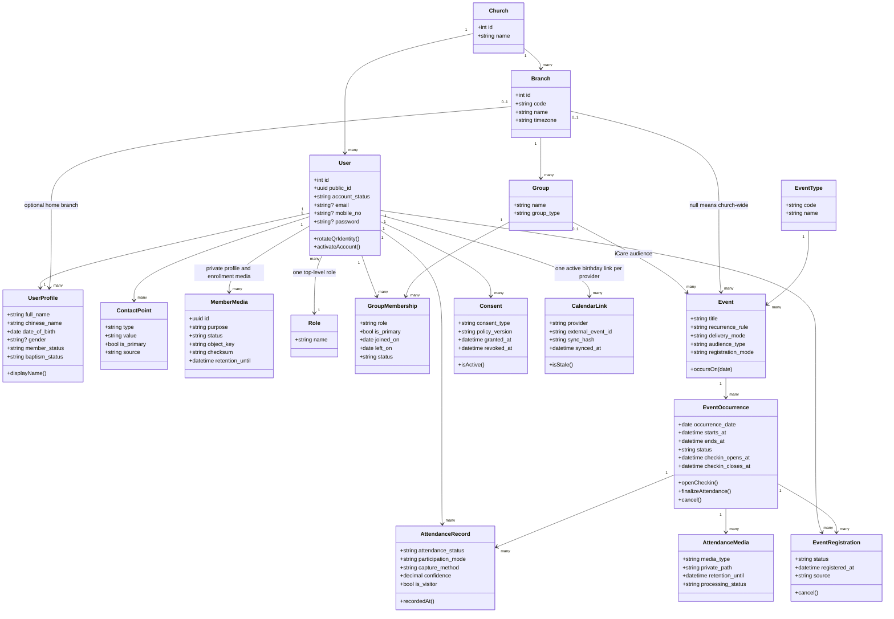

This is the logical domain diagram. It intentionally avoids exposing compatibility tables to product workflows. It shows the domain cardinality of one role per user. Physically, Laratrust retains `role_user`, with unique `(user_id, user_type)` enforcing at most one row and RoleAssignmentService enforcing exactly one role at activation and replacement. Only the three top-level roles are assignable in the product UI. Granular permissions remain implementation details mapped to those roles. Leader scope is derived from existing domain assignments such as event manager, iCare group leader, program facilitator, or ministry coordinator. A leader without a matching assignment cannot access that roster or attendance occurrence. The current `church-subadmin`, `staff`, custom permission presets, direct per-user permissions, `user_group`, and `usergroup_id` authorization paths must be migrated through reviewed mapping and cutover reports before removal.

#### 4.2.1 Physical upstream and IFGF extension map

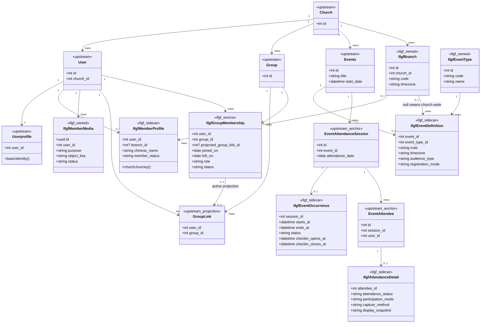

This split is deliberate. Graphify shows `User` at 177 edges, `Userprofile` at 79 edges, `Events` as a 32-degree hub, and `EventAttendanceSession` as a 23-degree hub used by both admin and API attendance controllers plus dashboard reporting. Replacing those classes or expanding their controllers would create a broad and recurring upstream conflict surface. The IFGF package therefore keeps the upstream rows as stable anchors, stores only additional semantics in one-to-one sidecars, and exposes logical aggregate services to all new controllers.

The aggregate storage rules are:

| Logical aggregate | Upstream anchor | IFGF-owned state | Write owner |
|---|---|---|---|
| Member profile | `users`, `userprofiles` | `ifgf_member_profiles`, `ifgf_contact_points`, `ifgf_consents` | `MemberProfileService` |
| Member media | upstream profile image remains a compatibility projection only | `ifgf_member_media`, `ifgf_media_variants`, private object storage | `MemberMediaService` |
| iCare membership | `groups`; active `group_links` projection | `ifgf_group_memberships` history | `GroupMembershipService` |
| Event definition | `events` basic title, visibility, dates, media flags | `ifgf_event_definitions` type, RRULE, timezone, branch or audience, registration behavior | `EventDefinitionService` |
| Event occurrence | `event_attendance_sessions` identity and compatibility date | `ifgf_event_occurrences` exact timestamps, lifecycle, overrides, cancellation | `OccurrenceService` |
| Attendance record | `event_attendees` identity and scan compatibility | `ifgf_attendance_details` status, mode, method, reason, confidence, immutable snapshot | `AttendanceRecorder` |

The physical sidecar cardinality is optional because untouched legacy or newly synchronized upstream rows may not yet be managed by IFGF. Once an aggregate is adopted by the IFGF package, its required sidecar must exist and package commands reject an incomplete aggregate. The sidecar's existence marks the anchor as IFGF-managed. Every legacy write entry point for an adopted anchor must delegate to the package service, become read-only, or reject the write with a clear conflict response. A model observer or equivalent guard supplies defense in depth, but route-level policy and service delegation remain mandatory. An unexpected direct anchor or projection change is never silently overwritten; reconciliation records a conflict for administrator review.

The compatibility projection is never an independent source of truth. Package services update the upstream anchor, sidecar, audit log, and any active projection within one database transaction. `ifgf_group_memberships.projected_group_link_id` is a unique nullable FK that identifies the exact upstream projection for that membership period. Ending a membership soft-deletes its linked projection but retains the FK; a later rejoin creates a new membership period and projection. Characterization tests protect upstream screens and APIs that continue to read the anchors.

### 4.3 Discipleship and ministry class diagram

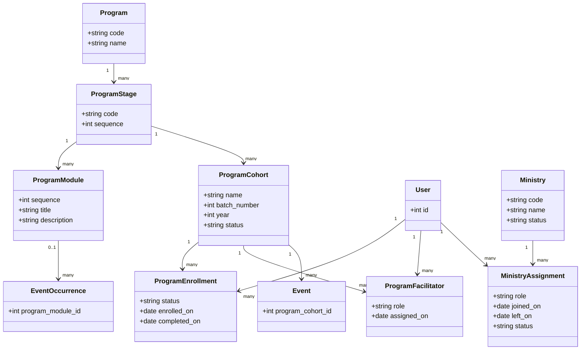

The initial program seed is `CGSL` with ordered stages `COME`, `GROW`, `SERVE`, and `LEAD`. Stage order is configuration, while progression rules are enforced by a service so administrators can approve exceptions.

### 4.4 Phase 2 biometric and edge-device class diagram

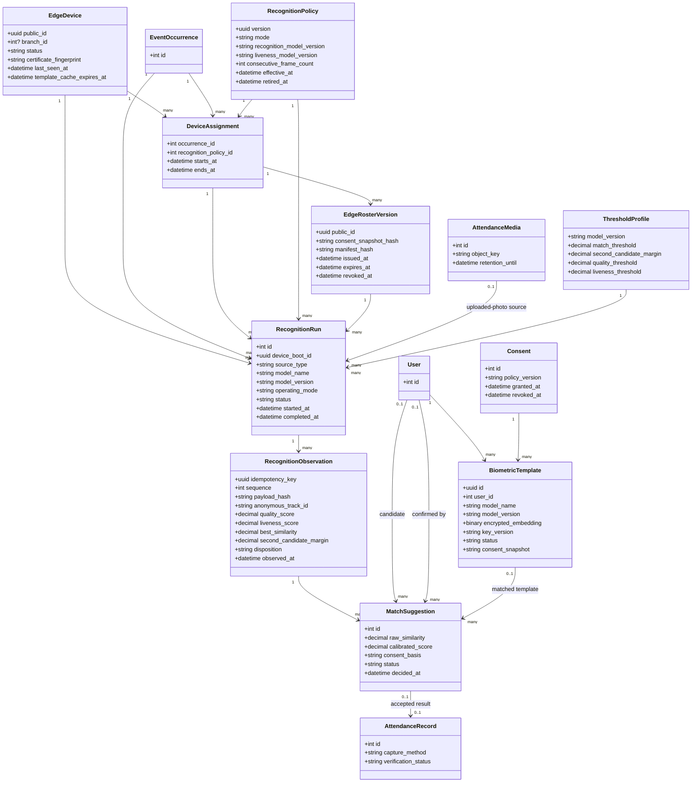

The Python edge device is a separate deployable system, not a Python process inside PHP-FPM or the Laravel queue worker. Laravel remains the control plane and source of truth for members, consent, occurrences, templates, devices, audit, and attendance. The edge agent owns camera capture, face detection and tracking, image-quality checks, presentation-attack or liveness checks, embedding inference, local candidate search, offline queuing, and device health.

Recognition has three separately approved modes:

1. `shadow` records only aggregate test metrics and reviewed candidate outcomes; it never writes attendance.
2. `assisted` creates a suggestion that a leader or admin must accept before `AttendanceRecorder` writes attendance.
3. `automatic` may write a present attendance record with capture method `face_auto` and verification status `auto_accepted` only when every automatic-decision gate passes. The record is immediately visible, auditable, deduplicated, and correctable until occurrence finalization.

Automatic-decision gates require an open occurrence assigned to the device, active explicit biometric consent, an active non-revoked template for the exact model version, approved image quality, passed liveness or presentation-attack detection, multi-frame identity consensus, a calibrated best-match threshold, an approved margin over the second candidate, a fresh template cache, an unused idempotency key, and no existing attendance for that member and occurrence. Failure of any gate creates no automatic attendance; it becomes an assisted suggestion or anonymous no-match event.

Raw webcam frames are processed in volatile memory and are not uploaded or retained by default. Non-consenting and unmatched people produce no persistent face crop, embedding, candidate identity, or movement history. Diagnostic crops are disabled by default and require a separate approved incident mode with a maximum retention period. A standard RGB webcam may be used for shadow and supervised assisted mode; unattended automatic mode requires camera and liveness performance that passes the local presentation-attack test, with RGB plus IR or depth preferred when a normal webcam cannot meet the approved spoof-resistance target.

### 4.5 Future ticketing class diagram

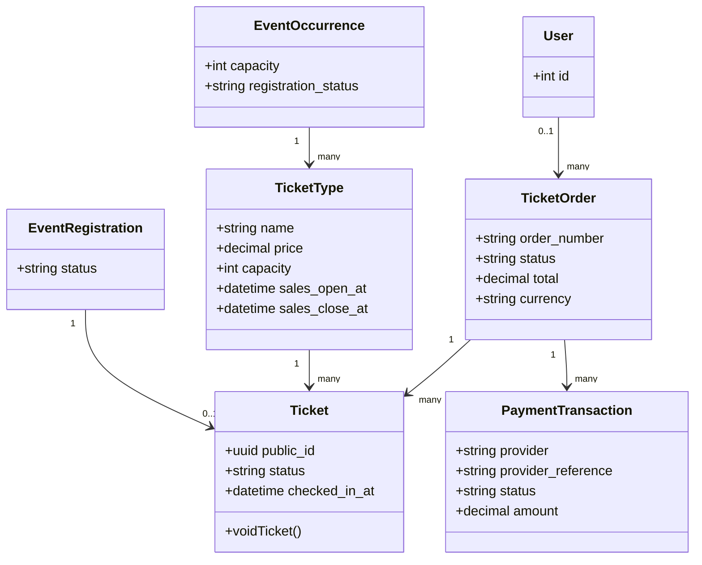

Ticket QR validation must be a separate admission service. A valid ticket may optionally create a member attendance record when the registration is linked to a member. This prevents ticket state and pastoral attendance state from becoming the same table.

### 4.6 Database change plan

#### Reused tables

`church`, `users`, `userprofiles`, `roles`, `permissions`, role and permission pivots, `groups`, `group_category`, `group_links`, `events`, `event_managers`, `event_attendance_sessions`, `event_attendees`, activity log, media, and notification tables.

#### Exceptional compatibility changes to upstream tables

Historical upstream create migrations remain immutable. These changes are implemented only through new IFGF-owned expand, backfill, verify, and contract migrations because the invariant must also protect legacy upstream code paths.

| Upstream table | Minimum permitted compatibility change |
|---|---|
| `users` | Add stable public identity, account state, and QR version; make password and mobile nullable for unclaimed or email-only records; require a verified login identity before authentication; deprecate legacy `usergroup_id` after role cutover |
| `userprofiles` | Add unique `user_id`; make legacy required fields such as gender nullable unless approved product policy requires them |
| `roles` and role pivots | Seed only `member`, `leader`, and `admin`; add unique `(user_id, user_type)` on `role_user`; migrate legacy roles through a reviewed mapping; remove direct `permission_user` grants after verification and disable arbitrary-grant UI |
| `event_attendance_sessions` | Remove date-only uniqueness so two same-day sessions are possible; retain `attendance_date` as a compatibility value derived from the IFGF occurrence start |
| `event_attendees` | Replace account-delete cascade with restrict or reviewed pseudonymization; retain upstream identity and scan fields |

No IFGF feature field is added directly to `group_links`, `events`, `event_attendance_sessions`, or `event_attendees` when it can live in a package-owned sidecar.

#### IFGF-owned sidecar tables

| Physical table | Anchor and purpose |
|---|---|
| `ifgf_member_profiles` | Unique `user_id`; Chinese name, home branch, member category, education, work, church journey, and pastoral follow-up attributes |
| `ifgf_group_memberships` | Effective-dated group membership history, role, primary marker, exception reference, provenance, and unique nullable `projected_group_link_id`; every active adopted membership has an exact upstream `group_links` projection |
| `ifgf_event_definitions` | Unique `event_id`; event type, branch or audience, RFC 5545 RRULE, timezone, delivery, registration, capacity, meeting, and program metadata |
| `ifgf_event_occurrences` | Unique `session_id` and unique event plus UTC `starts_at`; end time, lifecycle, check-in window, cancellation, series exception, and program-module metadata |
| `ifgf_attendance_details` | Unique `attendee_id`; attendance status, participation mode, capture method, reason, confidence, immutable display snapshot, and source reference |

#### New MVP tables

All package-owned physical tables use the `ifgf_` prefix to avoid collision with future upstream migrations. MVP tables are `ifgf_branches`, `ifgf_event_types`, `ifgf_contact_points`, `ifgf_member_media`, `ifgf_media_variants`, `ifgf_event_registrations`, `ifgf_attendance_media`, `ifgf_consents`, `ifgf_calendar_links`, `ifgf_calendar_viewer_access`, `ifgf_programs`, `ifgf_program_stages`, `ifgf_program_modules`, `ifgf_program_cohorts`, `ifgf_program_enrollments`, `ifgf_program_facilitators`, `ifgf_ministries`, `ifgf_ministry_assignments`, `ifgf_import_batches`, `ifgf_import_source_records`, `ifgf_source_identity_maps`, `ifgf_import_conflicts`, and `ifgf_import_exceptions`.

#### Future tables

`ifgf_biometric_templates`, `ifgf_threshold_profiles`, `ifgf_recognition_policies`, `ifgf_edge_devices`, `ifgf_device_assignments`, `ifgf_edge_roster_versions`, `ifgf_recognition_runs`, `ifgf_recognition_observations`, `ifgf_match_suggestions`, `ifgf_ticket_types`, `ifgf_ticket_orders`, `ifgf_tickets`, and `ifgf_payment_transactions`.

#### Column and migration contract

| Concern | Required design |
|---|---|
| Account nullability | `email`, `mobile_no`, and `password` may be null for imported or unclaimed users. At least one contact point is required for new public registration, but it does not automatically become a login identity. Unclaimed accounts cannot authenticate. |
| Profile one-to-one | Add a unique index on `userprofiles.user_id`; duplicate profiles must be resolved in the migration dry-run. |
| Attendance retention | Use soft deletion for members. A hard-erasure workflow replaces direct identifiers with an immutable pseudonymous snapshot where legally permitted; no FK cascade may silently delete attendance. |
| Occurrence identity | `ifgf_event_occurrences` has a unique key on event plus exact UTC `starts_at` and a unique `session_id`, allowing multiple services on the same calendar day while preserving the upstream session anchor, local timezone, and original source key. |
| Tenant consistency | Prefer deriving church, branch, and event through occurrence relationships. If redundant FKs remain for query performance, commands must validate them and database constraints must enforce every feasible relationship. |
| Source provenance | Every imported domain row links to a stable `(source_system, source_entity, source_key)` mapping and import batch. Conflict decisions are immutable and attributable. |
| Referential actions | Operational child records use restrictive deletes or soft deletes. Replace cascades that would erase pastoral, consent, registration, or attendance history. |
| Top-level role | Every activated user has exactly one of member, leader, or admin, enforced by unique `(user_id, user_type)` on `role_user`. Changing role requires an admin, confirmation, audit event, final-admin protection, and immediate session or permission-cache refresh. |
| Exact-role lifecycle | A transactional RoleAssignmentService locks the user and relevant admin rows, refuses activation with zero roles, replaces rather than appends the role, protects the final active admin under concurrency, and refreshes authorization state. The Laratrust pivot remains the physical model. |
| Legacy authorization | Inventory and replace every `usergroup_id`, `user_group`, group-based middleware, Gate bypass, login decision, redirect, installer, observer, query scope, and controller branch. Use expand, backfill, dual-verification, policy cutover, then contract; no production request may authorize from both systems indefinitely. |
| Calendar viewer identity | `ifgf_calendar_viewer_access` uniquely maps an application user to an approved Google viewer email and records requested, granted, revoked, or failed state plus actor and timestamps. Only leader and admin qualify; an application role never implies that the external ACL already exists. |
| Migration mechanics | Structural changes use expand, backfill, verify, then contract migrations. Every contract step requires a tested rollback or documented irreversible approval. |
| Extension ownership | IFGF migrations never edit upstream create migrations, package-owned tables use the `ifgf_` prefix, and every sidecar FK is unique when the relationship is one-to-one. |
| Aggregate writes | Only the named aggregate service may write an upstream anchor and its IFGF sidecar. Both writes and the audit entry occur in one transaction; compatibility projections are idempotently repairable. |
| Adopted-row guard | Sidecar existence marks an upstream anchor as IFGF-managed. Every existing upstream write route is inventoried and must delegate, become read-only, or reject writes. Unexpected direct changes create reconciliation conflicts and are not silently overwritten. |
| Group projection identity | `ifgf_group_memberships.projected_group_link_id` is unique and nullable. Active adopted memberships require it; ended periods retain the FK to the soft-deleted projection; rejoining creates a new period and projection. |
| Private media identity | Media rows use UUID public identities and opaque object keys. MySQL stores metadata only; permanent public URLs, raw image blobs, and personal data in object keys are prohibited. |
| Media purpose separation | `profile_display`, `biometric_enrollment`, `attendance_documentation`, and `diagnostic` are independent purposes with separate consent and retention. Changing purpose requires a new reviewed record, not a flag mutation. |
| Machine identity | Edge devices are service principals with device-scoped credentials and assignments. They never receive a human member, leader, or admin role and cannot call general member or administration APIs. |
| Recognition idempotency | Every device observation has a globally unique idempotency key. At most one accepted recognition decision and one attendance record exist per occurrence and member regardless of retries or offline replay. |
| Edge policy immutability | Every assignment and recognition run references one immutable policy version. Changing mode, model, liveness, threshold, frame count, offline lease, or capture window creates a new version rather than mutating prior evidence. |
| Edge roster lease | Every roster bundle is scoped to one device assignment, policy and model version, contains a consent-snapshot and manifest hash, is encrypted to that device, expires within the assigned service and no later than 24 hours, and receives explicit revocation tombstones. |
| Edge observation integrity | Unique `(edge_device_id, idempotency_key)` and `(recognition_run_id, sequence)` constraints reject duplicates. The signed payload hash, device key version, capture time, receipt time, policy, roster, model, and disposition remain immutable audit evidence. |

### 4.7 Critical constraints and indexes

1. One attendance record per occurrence and user.
2. One active primary iCare membership per user is enforced in MySQL with a generated nullable key that is unique only for current primary rows, plus transactional locking. A temporary exception is a separate audited record with approver, reason, and expiry, not a bypass of the invariant.
3. One enrollment per cohort and user.
4. One active birthday calendar link per user and provider.
5. One event occurrence per event and occurrence timestamp.
6. Email is unique only when present after lowercase normalization. It is not a foreign key.
7. Phone normalization uses E.164 where possible and retains the raw imported value for review.
8. Public URLs and QR codes never expose sequential database identifiers.
9. Extensible codes use `varchar` plus application validation, not MySQL enums.
10. Production uses MySQL 8.4 LTS with `utf8mb4` and UTC timestamps. MySQL 8.0 is supported only as an import or upgrade source. User-facing times render in the branch timezone, default `Asia/Taipei`.
11. Foreign keys and unique constraints are named explicitly and tested for concurrent writes.
12. Every persisted table has timestamps; mutable operational tables use actor-aware audit logging.
13. At most one active biometric template exists per user and model version; replacement revokes the prior template and publishes a tombstone in the same reviewed workflow.
14. At most one active device assignment exists for a device and overlapping occurrence window. Assignment changes use locking and reject ambiguous concurrent operation.
15. At most one ready, non-superseded `profile_display` media row exists per user. Replacement is transactional and old objects follow the recovery and purge policy.

### 4.8 Profile picture, attendance media, and biometric storage contract

Profile pictures are private member media, not public website assets and not MySQL image blobs. The default production storage is a provider-neutral S3-compatible private object store in an approved region. Laravel stores metadata and opaque object keys in MySQL, while the binary objects remain outside the web server filesystem. A local private Laravel disk is allowed only for a pilot with tested backup and a documented migration path to S3-compatible storage.

`ifgf_member_media` stores `id`, `user_id`, `purpose`, `status`, storage disk, bucket, opaque object key, detected MIME type, byte size, SHA-256 checksum, dimensions, capture or upload time, uploader, replacement link, processor version, retention deadline, purge time, and deletion timestamps. `ifgf_media_variants` stores the parent media ID, variant type, processor version, object key, MIME type, dimensions, byte size, and checksum with a unique media, variant, and processor-version key. Object keys use only opaque media identities and purpose-neutral paths such as `private/v1/{media_uuid}/original`; names, user IDs, email addresses, phone numbers, birthdays, branch labels, and original filenames never appear in keys.

The upload pipeline is:

1. Admin requests a short-lived upload authorization for a declared purpose and maximum size.
2. The client uploads to a private quarantine prefix with a single-use presigned URL, or streams through Laravel when the selected host cannot support direct upload.
3. A queued validator checks magic bytes, decodes the image, rejects malformed or oversized images, strips EXIF and location metadata, normalizes orientation and color space, re-encodes the image, and records the checksum.
4. The processor creates square 256px and 512px WebP variants plus a JPEG fallback, then promotes approved objects to the private clean prefix.
5. `MemberMediaService` transactionally activates the new profile picture, updates any required upstream compatibility field, and retires the prior picture.
6. Access is through an authorized Laravel response or a short-lived signed object URL. The database stores an object key, never a permanent or public URL.

Profile-display consent and biometric-enrollment consent are different purposes. A normal profile picture is not used to create a face template unless the member has separately opted into biometric enrollment under the current policy version. Attendance group photos are never silently converted into enrollment material. Profile originals and display variants follow the ordinary member-media retention schedule; biometric enrollment media, diagnostic crops, and templates have separate shorter or purpose-specific schedules.

Face templates are numerical biometric data and are not image variants. For the expected membership size, the server stores each fixed-length embedding as an application-encrypted binary blob in `ifgf_biometric_templates` with model name, model version, source enrollment media IDs, consent snapshot, encryption key version, quality score, status, creation time, revocation time, and deletion deadline. A dedicated biometric key-encryption key, separate from `APP_KEY`, provides envelope encryption and rotation. Templates never enter public object storage, CDN caches, logs, analytics, Graphify output, fixtures, or general profile APIs.

Default retention behavior, subject to the approved privacy review, is:

| Data | Default behavior |
|---|---|
| Live webcam frames | Memory only; zero persistent retention |
| Anonymous no-match metadata | Aggregate counters only; no persistent face-level event |
| Diagnostic face crops | Disabled; incident mode only with explicit approval and at most 24 hours |
| Recognition observation and audit metadata | 90 days, then aggregate or delete according to the approved audit policy |
| Superseded profile media | 30-day recovery window, then purge from active storage; backup expiry follows the documented backup schedule |
| Biometric enrollment media | Purge after template verification unless separate retention is explicitly approved |
| Active biometric template | Until consent withdrawal, member exit, template replacement, or policy expiry |
| Revoked template on server | Immediately disabled; cryptographic or physical deletion job begins immediately and is audited |
| Revoked template on edge devices | Tombstone on next sync; device refuses recognition when its consent or template cache is older than 24 hours |

Storage provider selection must verify encryption, private buckets, presigned uploads and downloads, lifecycle rules, deletion behavior, audit logs, backup or replication, export portability, and the approved Taiwan-to-hosting-region data flow. Cloudflare R2 is S3-compatible, but an Asia-Pacific location hint is best-effort rather than an Indonesian or Taiwanese residency guarantee; it is not approved for member or biometric media solely because Cloudflare already provides DNS.

---

## 5. Functional Requirements

### FR-01 Member registry and lifecycle, MVP

1. Administrators can create, view, search, filter, edit, deactivate, exit, merge, and restore members according to permissions.
2. Profiles support all validated workbook fields and the current IFGF member fields.
3. Member status values include visitor, active, inactive, and exited.
4. Baptism status and date are stored separately.
5. The user record holds the canonical email and mobile contact. Contact points hold LINE, WhatsApp when distinct from mobile, alternate email or phone, and future channels with primary and verification flags within each channel type.
6. A possible-duplicate workflow checks normalized email, normalized phone, and name plus date of birth.
7. Merge keeps a complete audit trail and reassigns attendance, memberships, enrollment, ministry, and calendar links.
8. Confidential pastoral notes are admin-only and never exposed to member or leader routes, searches, attendance screens, exports, or Calendar views.
9. Profile picture is optional. An admin can upload, crop, replace, or remove it through the private-media pipeline in Section 4.8.
10. The member can view their own active profile picture. A leader sees only the approved small thumbnail when it is necessary to confirm identity within an assigned attendance scope. Admin has audited management access.
11. Replacing a profile picture retires the old object without changing historical attendance snapshots. Removing it revokes new signed access immediately and schedules object and variant deletion.
12. Importing an existing profile image requires source provenance, validation, EXIF removal, and an exception report for missing or corrupt files.

### FR-02 Registration, member portal, and member QR, MVP

1. Public registration is mobile-first and Indonesian by default.
2. Required fields are configurable. The initial minimum is full name, birthday, one contact method, home branch, privacy consent, and follow-up preference.
3. Google sign-in may accelerate account activation but is not required for initial launch.
4. A visitor created by a leader may remain unclaimed until invited.
5. Email-only, phone-only, LINE-only, and imported no-password records are valid domain fixtures. In the MVP, only an account with a verified email and established credential, or an approved Google identity, may authenticate. Phone-only and LINE-only records remain unclaimed until a verified login identity is added.
6. A member can view their own profile, review consent, and display a personal QR. Profile fields are read-only for member and leader; an admin performs edits.
7. Personal QR encodes an opaque public identifier and QR version. Administrators and members can rotate it.
8. Welcome notification is sent only through a verified supported channel and contains an activation link plus QR access instructions.
9. Registration windows and rate limits are configurable.
10. The member portal contains only own read-only profile, own QR, and authenticated administrator-published church-information pages. Attendance operations, birthday Calendar, administration, reports, and other member profiles are unavailable to the member role.

### FR-03 Event catalog and occurrences, MVP

1. Administrators manage event types without code changes.
2. Events support one-off and recurring schedules, nullable branch for church-wide events, location, timezone, delivery mode, audience, capacity, registration mode, gallery, attendance, and assigned managers.
3. Delivery mode values are onsite, online, and hybrid.
4. Audience types are open, branch, iCare group, program cohort, ministry, and registered-only.
5. Occurrences are generated idempotently from the event recurrence definition.
6. Occurrence lifecycle values are planned, open, finalized, cancelled, and reopened.
7. Check-in and registration windows are occurrence-specific and may override event defaults.
8. Online meeting URLs are visible only to authorized or registered users.
9. Recurrence uses RFC 5545 RRULE semantics, stored with an explicit IANA timezone. A rolling configurable generation horizon creates occurrences idempotently.
10. Editing a series requires a scope of this occurrence, this and following, or whole series. Generated occurrences retain exception and cancellation history rather than being silently replaced.
11. Time conversion handles daylight-saving changes in the event timezone even though the default Taiwan timezone has no daylight-saving transition.

### FR-04 Common attendance engine, MVP

1. Every attendance write goes through `AttendanceRecorder`.
2. Attendance status values are present, absent, and excused.
3. Participation mode values are onsite and online; mode is null for absent records.
4. Initial capture methods are manual, member_qr, import, zoom_import, and photo_suggestion. Phase 2 adds face_assisted and face_auto without creating another attendance table.
5. Capture methods are application-validated strings so future values do not require schema changes.
6. Open-audience events store present records only. Closed-roster events create a final snapshot including absent or excused members.
7. Duplicate scans return the existing record and a clear message rather than creating a duplicate.
8. Locked or finalized occurrences reject normal writes. Authorized administrators can reopen with a mandatory reason.
9. Manual search is always available when camera or QR scanning fails.
10. Every write records actor, timestamp, source, and audit context.
11. A leader may record attendance only when an active event, group, cohort, ministry, or occurrence assignment grants that scope. The attendance UI exposes only the minimum member identity required to confirm the correct person.
12. An admin may operate and reopen attendance for any scope.

### FR-05 iCare, MVP

1. ChurchCMS groups with group type `icare` represent iCare groups.
2. Groups support branch, one or more leaders, active members, guests, and effective-dated membership history.
3. A member has at most one active primary iCare membership unless an administrator records a temporary exception.
4. Leaders see only groups they lead unless granted broader permission.
5. The mobile attendance screen loads the active roster, supports select all, search, present onsite, present online, absent, excused, notes, and visitor addition.
6. Registered visitors from another group are flagged as visitors without changing their primary group.
7. An unregistered visitor can be quick-added as an unclaimed member record.
8. A leader may upload one or more group photos to private storage.
9. In Phase 1, photos are documentation only. In Phase 2, uploaded group-photo processing remains assisted and requires leader confirmation; automatic attendance is limited to the separately gated live entrance-device workflow in FR-14.
10. Finalization produces totals and an exception list for missing required reasons.
11. A primary-group transfer locks the member row, closes the old membership, opens the new membership, and writes an audit record in one transaction. Temporary cross-group participation is recorded as a visit or approved exception with an expiry.

### FR-06 COME–GROW–SERVE–LEAD discipleship, MVP

1. Seed one program named CGSL and four ordered stages: COME, GROW, SERVE, LEAD.
2. Administrators manage curriculum modules with stage, order, title, description, and active status.
3. Coordinators create cohorts with stage, branch, batch number, year, date range, and status.
4. Members may enroll in multiple historical cohorts but only one active cohort per stage unless approved.
5. Teachers and coordinators are assigned with effective dates.
6. Each weekly lesson is an event occurrence linked to its cohort and optional module.
7. Teachers record attendance through the common closed-roster workflow.
8. Enrollment status values are invited, enrolled, active, completed, withdrawn, and failed.
9. Completion requires configurable attendance and module criteria plus coordinator approval.
10. Member profile shows stage history and current progress.
11. Existing IFGF CGSL members, teachers, materials, groups, sessions, and attendance are migrated.

### FR-07 Ministries and service assignments, MVP

1. Administrators manage ministry types and active status.
2. Members receive effective-dated ministry assignments with role and notes.
3. Ministry coordinators view active rosters and history.
4. Ministry may be selected as an event audience.
5. Existing IFGF ministry types and member assignments are migrated.

### FR-08 Birthday synchronization with Google Calendar, MVP

1. Member create, birthday change, display-name change, deactivation, merge, and approved erasure enqueue synchronization. Unrelated profile changes such as iCare transfer do not alter the Calendar event.
2. A dedicated shared calendar is configured by calendar ID. The integration identity must have write access.
3. The adapter creates an annual all-day recurring birthday event and stores both provider calendar ID and event ID.
4. A stable sync hash covers fields represented in the event.
5. Updates patch the recurring parent when possible. Missing or invalid remote events are recreated once.
6. Deactivation or exit follows an approved policy: delete or retain without adding private status text. Erasure removes the remote event and records a local tombstone without personal content.
7. `ifgf:sync-birthdays --dry-run` reports create, update, delete, repair, duplicate, and failure counts.
8. Jobs retry with backoff and never block member registration.
9. Calendar operations are idempotent and use local link state plus provider IDs to prevent duplicates.
10. A legacy Birthday ID is adopted only when it resolves on the configured target calendar and its contents match the member. An ID from another calendar is copied or recreated on the target calendar, then the old ID is recorded as a tombstone for duplicate cleanup.
11. Event content is allowlisted to display name plus a birthday label. It must not include birth year, age, contact data, iCare, pastoral fields, or private notes.
12. Calendar ACLs are audited before cutover and quarterly afterward. Viewer scope is a documented church decision, while the integration identity receives only the access needed to manage the dedicated calendar.
13. February 29 birthdays use the church-approved non-leap-year policy and explicit branch timezone. Acceptance covers missing events, wrong-calendar legacy IDs, duplicates, revoked access, and retry after partial failure.
14. An authenticated leader or admin can open a birthday page containing the configured Google Calendar iframe in read-only mode. Members cannot access this page.
15. The birthday Calendar remains private. Every authorized leader or admin viewer must use an approved Google identity that has Calendar viewer access through a managed Google Group or individual ACL. `ifgf_calendar_viewer_access` records application user, Google viewer email, grant state, grant and revoke timestamps, and actor.
16. The page fails closed when the application role, recorded viewer grant, Google session, or Calendar ACL is missing. It must never fall back to a public Calendar or leak event data outside the iframe.
17. The leader birthday page cannot create, update, delete, or synchronize birthday events. Calendar event management, ACL provisioning, and synchronization remain admin-only.
18. If the owner later chooses an API-rendered calendar instead of Google embedding, that is a separately approved contract change with equivalent role, privacy, and allowlist tests.

### FR-09 Worship Night and online attendance, MVP

1. Seed weekly Wednesday Worship Night as an online or hybrid event.
2. A leader assigned to the Worship Night occurrence may record online attendance manually.
3. An admin may record or correct online attendance for any Worship Night occurrence.
4. Administrators may import a Zoom participant report through a mapping preview.
5. Zoom import matches verified email first, normalized display name second, and routes ambiguous rows to manual review.
6. Reimport is idempotent using occurrence and source-row fingerprint.
7. Native Zoom API integration is optional Phase 2 work and must use the same import service contract.

### FR-10 Reporting, dashboard, and export, MVP

1. Dashboard shows attendance trends by branch, event type, iCare, program, ministry, and participation mode.
2. New-member report shows configurable join period and follow-up status.
3. Inactive-risk report identifies configurable consecutive missed Sunday occurrences.
4. Dashboard, risk analysis, and general reports are admin-only. A leader's assigned attendance screen may show only the occurrence counts needed to complete and verify that attendance task.
5. Reports provide CSV and XLSX export, with permission and audit checks.
6. Historical workbook totals remain accessible through migration reconciliation reports.
7. Personally sensitive fields are excluded from exports unless explicitly selected by an authorized role.

### FR-11 Roles, privacy, consent, and audit, MVP

1. Seed exactly three assignable top-level roles: member, leader, and admin.
2. Each authenticated user has exactly one top-level role. Leader inherits member capabilities; admin has every application capability.
3. Member authorization is self-only for profile and QR plus read access to published church-information pages.
4. Leader authorization adds assigned-scope attendance and read-only access to the birthday Calendar page. It does not add general member, report, settings, role, import, or Calendar-management access.
5. Admin authorization covers the complete application. Admin-only destructive or external operations still require confirmations and audit.
6. Authorization combines top-level role and resource scope. Navigation visibility must match server-side policies, but hidden navigation never replaces authorization.
7. Role changes are admin-only, audited, protected against removing the final active admin, and invalidate affected authorization caches or sessions immediately.
8. Activation and role replacement use a transaction and row locks. Activation refuses zero roles; role replacement cannot append a second role; concurrent changes cannot remove the final active admin.
9. Legacy ChurchCMS roles, direct permissions, permission presets, `usergroup_id`, `user_group`, group-based middleware, Gate bypasses, login rules, redirects, installers, query scopes, and controller branches are migrated through an explicit mapping and cutover report. No legacy path may silently grant broader access.
10. Consent records store type, policy version, method, grant time, revoke time, and actor.
11. Profile photos and attendance media use private storage and expiring signed access.
12. Face templates, when introduced, are encrypted and separated from ordinary profile images.
13. Revocation stops new biometric processing immediately and schedules template deletion.
14. Audit coverage includes member edits, merge, attendance, reopening, exports, consent, role changes, Calendar access or repair, and ticket actions.
15. Before MVP production data is loaded, the church must approve a privacy-impact and data-flow review covering controller and processor responsibilities, applicable Taiwan and Indonesia law, cross-border transfers, provider agreements, data residency, retention, access, correction, deletion, breach response, and backup disposal.
16. The review inventory includes MySQL, file storage, backups, Cloudflare logs, Google Calendar, email, Zoom imports, exported files, and administrator devices.
17. Before enabling biometric features, a separate legal and pastoral approval must cover explicit consent, bystanders, model providers, template security, retention, access, and deletion.
18. Biometric consent is voluntary, purpose-specific, recorded, withdrawable, and never bundled with ordinary membership or profile-picture consent. QR and manual attendance remain equivalent alternatives with no pastoral disadvantage.
19. Entrance signage explains local camera processing, the controller, purpose, retention, contact channel, and alternatives before a person enters the capture zone.
20. A device is a machine service principal, not a fourth human role. Its credential is limited to heartbeat, assigned occurrence configuration, consented template synchronization, and idempotent recognition-event submission.
21. Recognition of minors is disabled by default until the church approves the applicable guardian-consent and child-data procedure.
22. Consent withdrawal disables the server template immediately, publishes a revocation tombstone to every assigned device, and is included in backup-expiry and deletion reporting.

### FR-12 Data migration and cutover, MVP

1. Import commands have `--dry-run`, `--commit`, source identifier, and machine-readable exception output.
2. Imports are idempotent and tag every created or updated row with migration batch provenance.
3. Member mapping covers the complete validated workbook schema.
4. `Daftar Absensi` is imported into event occurrences and attendance records.
5. Matrix and annual sheets are used to reconcile counts, not blindly converted into duplicate records.
6. Existing IFGF database export is migrated for activity types, sessions, registrations, iCare, CGSL, ministries, users, roles, and permissions.
7. Cross-system duplicates are resolved through a review table before commit.
8. No source row is silently discarded.
9. Each batch stores source file hash, extraction timestamp, importer version, operator, status, row counts, and rollback deadline. Each source record stores stable source key, raw payload hash, target mapping, and outcome.
10. Conflict decisions store field-level source precedence, chosen value, reviewer, reason, and time. Re-running an identical source does not duplicate a domain record or repeat an external side effect.
11. Existing password hashes are migrated only if their algorithm is supported and verified. Otherwise, accounts are imported unclaimed and receive a single-use activation or credential-reset flow.
12. Cutover defines source freeze time, final delta extraction, post-freeze write policy, exception owner, and acceptance sign-off.
13. Rollback restores the database only before new production writes begin. After that point, recovery uses forward correction. Google Calendar changes use a recorded compensation manifest that can delete newly created events or restore changed allowlisted content.

### FR-13 Event registration, MVP foundation and Phase 3 ticketing

1. The MVP supports free registration for configured occurrences, capacity, waitlist, cancellation, admin registration, and roster export.
2. Registered-only attendance validates current registration.
3. Confirmation notifications include occurrence details and calendar link.
4. Phase 3 adds ticket types, orders, payment transactions, ticket QR, transfer policy, refund state, and admission scanning.
5. Ticket admission and member attendance remain separate records connected by registration.
6. Payment providers are adapters selected by configuration. No provider is chosen in this PRD.

### FR-14 Biometric enrollment, group-photo assistance, and entrance-device attendance, Phase 2

1. Members separately consent to profile-image storage, biometric enrollment, live entrance recognition, and uploaded group-photo matching as distinct purposes.
2. Enrollment captures multiple admin-reviewed images under controlled lighting and pose guidance, then creates quality-scored, model-versioned encrypted templates. A profile picture alone is not enrollment consent.
3. Group-photo processing returns consented candidate member IDs and scores only. It remains assisted and requires leader confirmation before attendance.
4. The entrance recognizer is a separately deployed Python edge agent in a dedicated repository such as `ifgf-face-attendance-edge`. It communicates with Laravel through a versioned device API; it does not connect directly to MySQL or object storage.
5. The recommended edge runtime uses OpenCV-compatible camera capture and an ONNX Runtime inference pipeline so CPU, GPU, or accelerator execution can change without changing the Laravel contract. Exact models require a documented commercial-use license, immutable artifact hash, reproducible version, local accuracy test, and bias review before approval.
6. A device is paired once by an admin, receives a revocable device identity, and authenticates with mutual TLS or an equivalently strong device certificate plus short-lived rotating credentials. Credentials are scoped to one device and approved branches or occurrences.
7. The device downloads only active consented template IDs, encrypted template payloads required for local inference, minimal display identity needed for supervised confirmation, threshold profiles, model hashes, assignments, and revocation tombstones. It never downloads full profiles, contact data, birthdays, pastoral notes, roles, or unrelated attendance.
8. The local template cache and offline outbox are encrypted at rest, protected by full-disk encryption and a restricted operating-system account, and expire closed. A cache older than 24 hours cannot make automatic decisions.
9. Recognition processes frames locally through face detection, tracking, quality checks, liveness or presentation-attack detection, embedding, candidate comparison, second-candidate margin, and multi-frame consensus. A single-frame similarity score is insufficient.
10. Live frames remain in memory and are discarded. Non-consenting or unmatched tracks create only aggregate counters. No remote video stream, continuous recording, face crop, embedding, or movement history is stored by default.
11. Every accepted or assisted device event contains device ID, occurrence ID, anonymous track ID, idempotency key, capture time, model and threshold-profile versions, quality and liveness results, best and second-match metrics, consent version, candidate public ID when permitted, operating mode, and disposition. It never contains a raw frame.
12. The edge outbox survives a WAN outage and replays signed events in order. Laravel rejects expired assignments, stale caches, invalid signatures, tampered payloads, replayed nonces, revoked devices, withdrawn consent, closed occurrences, and duplicate idempotency keys.
13. In `shadow` mode, the device writes no attendance. Reviewed outcomes measure false match, false non-match, liveness failure, unknown-person, latency, and demographic performance.
14. In `assisted` mode, the device creates a suggestion. A scoped leader or admin accepts or rejects it before `AttendanceRecorder` writes attendance.
15. In `automatic` mode, Laravel, not the device, evaluates every server-side decision gate again. A passing event calls `AttendanceRecorder` with capture method `face_auto` and verification status `auto_accepted`; failed gates create an assisted suggestion or no match.
16. The automatic threshold profile is immutable per model, camera class, branch, and operating mode. It records the local validation dataset version, false-match target, measured false-match and false-non-match results, confidence intervals, second-candidate margin, quality and liveness thresholds, approver, and effective dates.
17. Automatic mode is disabled until shadow mode completes at least four consecutive representative services and 500 recognition opportunities with zero confirmed false identity matches, a separate statistically powered evaluation demonstrates the approved system-level false-identification bound, and manual or QR fallback remains staffed. The initial target is a one-sided 95% upper bound no greater than 1 in 10,000 opportunities, which requires roughly 30,000 error-free representative opportunities; if the approved bound cannot be demonstrated, the device remains assisted.
18. Duplicate recognition of the same member in one occurrence returns the existing attendance record. A configurable cooldown suppresses repeated UI notifications without discarding audit evidence of suspicious replay.
19. A leader can immediately correct a false acceptance, identify a false rejection, or mark an observation unresolved. Corrections are audited and feed evaluation reports, but the system never retrains or changes a member template automatically from attendance observations.
20. Device health includes camera state, frame-processing latency, inference latency, queue depth, outbox age, disk usage, model hash, template-cache age, clock drift, certificate expiry, temperature when available, and last successful sync.
21. Model and application updates are signed, hash-verified, staged to one device first, and automatically roll back after health or accuracy regression. The device retains the last known-good compatible model and agent version.
22. Before Phase 2 starts, configuration contains concrete retention periods for enrollment images, group photos, diagnostic crops, observations, suggestions, templates, device logs, and backups. Expiry and consent deletion are testable and audited across Laravel, object storage, backups, and every device cache.
23. Before automatic mode, the church approves the camera capture zone, signage, alternative check-in, bystander handling, minors policy, incident response, device physical security, model license, accuracy report, false-match target, and applicable Taiwan and Indonesia legal basis.
24. One confirmed false automatic identity disables automatic mode for the affected policy cohort until the incident is reviewed, data is corrected, causes are addressed, and the full promotion gate is approved again.
25. Automatic mode may create only `present`, `onsite`, `face_auto` attendance. It cannot record absence, excuse, notes, change participation mode, reopen a finalized occurrence, or overwrite an existing pastoral decision.

---

## 6. Key Workflows

### 6.1 Member registration and birthday synchronization

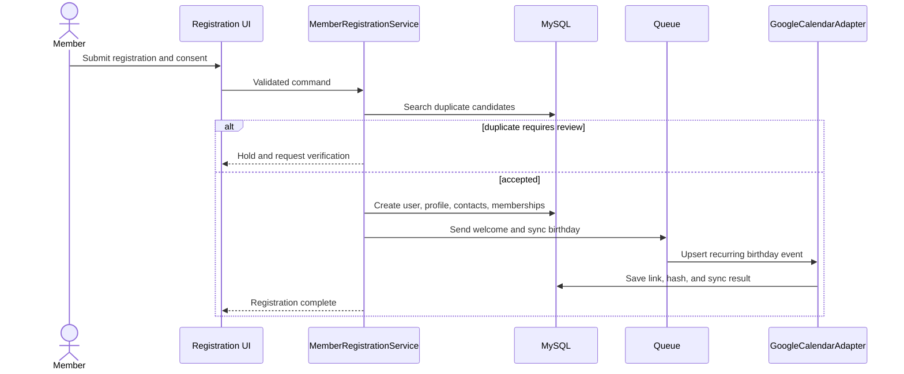

### 6.2 Staffed QR check-in

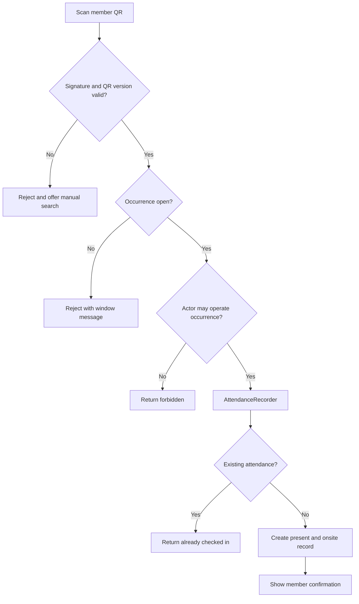

### 6.3 iCare weekly attendance

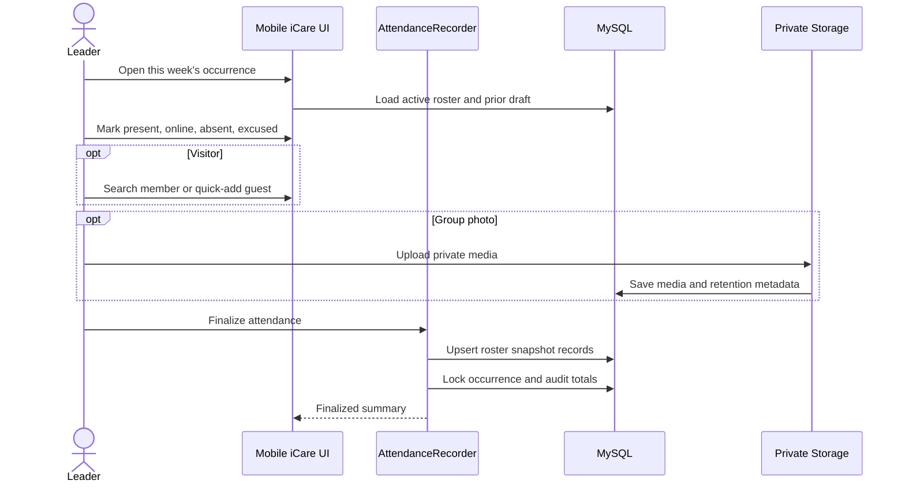

### 6.4 CGSL cohort delivery

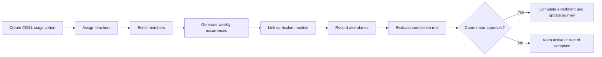

### 6.5 Zoom report import

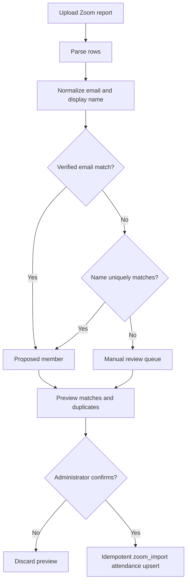

### 6.6 Entrance-device face attendance

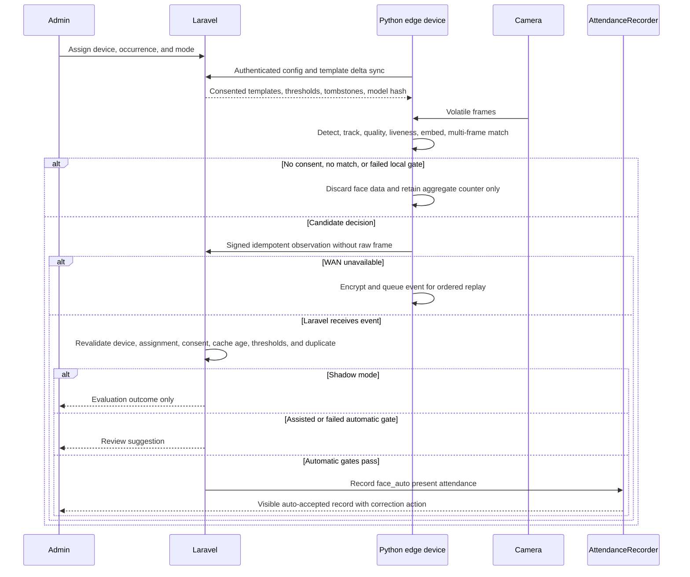

---

## 7. Application Architecture

### 7.1 Module boundaries

```text
custompackages/ifgf/church-operations/
  composer.json
  src/
    ChurchOperationsServiceProvider.php
    Domain/
      Members/
      Events/
      Attendance/
      ICare/
      Discipleship/
      Ministries/
      Registration/
      Consent/
    Application/
      Commands/
      Queries/
      DTO/
    Integrations/
      GoogleCalendar/
      Zoom/
      EdgeRecognition/
      ObjectStorage/
      Payments/
    Http/
      Controllers/
      Requests/
      Resources/
      Policies/
    Jobs/
    Console/Commands/
  routes/
  database/migrations/
  resources/views/
  resources/lang/
  tests/
```

The package is loaded through Composer path repository and Laravel package auto-discovery, matching the repository's existing local-package convention. The installation contract requires a root `composer.json` path-repository and `require` entry, a package `composer.json` with PSR-4 autoloading and `extra.laravel.providers`, and a committed root `composer.lock` resolution. Root `composer.json` and `composer.lock` are approved upstream-owned touchpoints and must appear in `UPSTREAM.md`. Provider smoke tests prove that package routes, migrations, views, translations, commands, policies, and package tests are discoverable from a clean checkout. New controllers validate and delegate. Domain services own state changes. Integrations implement contracts and do not leak provider payloads into domain models.

Upstream models keep their exact names and paths, including `App\Models\Events`, `App\Models\Userprofile`, `App\Models\EventAttendanceSession`, `App\Models\EventAttendee`, and `App\Models\GroupLink`. The IFGF package may use repositories, observers, policies, and runtime relation resolvers, but it must not replace or rename these classes. New routes are package-owned and loaded by the package provider rather than appended throughout upstream route files. New views use an `ifgf::` namespace and extend upstream layouts only through documented stable seams.

#### 7.1.1 Edge-recognition project boundary

Live recognition is a separate Python edge application, provisionally named `ifgf-face-attendance-edge`, deployed on the church entrance device. It is not embedded in PHP-FPM, a Laravel queue worker, or the public application container. Laravel remains the control plane and sole system of record: it owns members, consent, occurrence assignments, template lifecycle, calibrated threshold profiles, device credentials, attendance policy, audit, and final attendance writes. The edge application owns webcam capture, face detection and tracking, quality checks, presentation-attack detection, embedding inference, multi-frame consensus, local candidate comparison, a minimal encrypted template cache, an encrypted offline outbox, and device health.

The edge application communicates only with a versioned Laravel device API. It never connects directly to MySQL or object storage. Each physical device has a revocable machine identity, mutually authenticated transport, a device signing key with recorded fingerprint and key version, rotating short-lived application credentials, and an occurrence assignment. Every observation request includes device and key identities, request UUID, idempotency key, canonical body hash, capture timestamp, monotonic sequence, and a device signature; transport authentication alone is insufficient evidence for an offline observation. Member, leader, and admin sessions are never reused as device credentials. Signed edge releases, pinned model hashes and licenses, secure boot where supported, full-disk encryption, outbound-only firewall rules, clock-drift monitoring, and remote revocation are deployment gates.

The recognition modes are `shadow`, `assisted`, and `automatic`. Shadow mode produces evaluation metrics but no named attendance or leader suggestion. Assisted mode may show a time-limited candidate to an authorized leader, who must confirm it. Automatic mode is available only after Phase 2C approval; Laravel independently revalidates every FR-14 gate through `AutoAttendancePolicy` and invokes the same `AttendanceRecorder` used by manual and QR capture. A camera or edge device never writes `event_attendees` or the unrelated legacy `attendances` table directly. The edge UI distinguishes `queued offline` from `attendance confirmed` and shows no success confirmation until Laravel acknowledges the attendance. Group-photo processing remains assisted and is not an automatic-attendance path.

#### 7.1.2 Upstream compatibility ledger and contribution flow

Phase 0 creates `UPSTREAM.md` as a living compatibility ledger. Each entry records the upstream baseline SHA, changed upstream-owned files, reason, alternative extension points considered, characterization tests, merge-conflict notes, and one of these dispositions: `required-downstream`, `candidate-for-upstream`, `submitted`, `accepted-upstream`, or `retired`.

The supported-platform upgrade is the largest expected downstream patch. It must be developed as an IFGF-neutral commit series from the reviewed upstream baseline and proposed upstream when practical. If upstream remains on an unsupported framework, production security takes precedence: IFGF may carry the reviewed platform patch, but every upstream sync must replay the compatibility and merge regression suite. IFGF feature commits must not be mixed into the platform-upgrade series.

For upstream contributions, create a clean `contrib/*` branch from `upstream/main`, reproduce only the generic change, add focused tests and documentation, and submit it according to `CONTRIBUTING.md`. Never submit IFGF branding, internal workflows, member data, credentials, deployment details, or unrelated refactoring.

### 7.2 Required contracts

```php
interface AttendanceCaptureStrategy
{
    public function candidates(EventOccurrence $occurrence, CaptureInput $input): array;
}

interface CalendarSync
{
    public function upsertBirthday(User $member): CalendarSyncResult;
    public function removeBirthday(User $member): CalendarSyncResult;
}

interface OnlineAttendanceImporter
{
    public function preview(EventOccurrence $occurrence, UploadedFile $file): ImportPreview;
    public function commit(ImportPreview $preview): ImportResult;
}

interface DeviceObservationIngest
{
    public function ingest(EdgeDevice $device, RecognitionObservationInput $input): RecognitionDecision;
}

interface DeviceConfigurationSync
{
    public function configuration(EdgeDevice $device, DeviceConfigCursor $cursor): DeviceConfigDelta;
}

interface AutoAttendancePolicy
{
    public function evaluate(EdgeDevice $device, RecognitionObservationInput $input): AutoAttendanceDecision;
}

interface PrivateMemberMedia
{
    public function initiateUpload(User $actor, MemberMediaIntent $intent): UploadGrant;
    public function finalizeUpload(User $actor, UploadedObject $object): MemberMedia;
}

interface PaymentGateway
{
    public function createPayment(TicketOrder $order): PaymentIntent;
    public function handleWebhook(array $payload): PaymentResult;
}
```

The payment contract is future-only. It exists here to prevent ticketing from being coupled to a provider.

### 7.3 Background jobs

| Job | Trigger | Idempotency key |
|---|---|---|
| Sync member birthday | Profile lifecycle event | provider plus member plus sync hash |
| Send welcome notification | Account activation or import invitation | user plus notification type plus version |
| Generate occurrences | Scheduler | event plus occurrence timestamp |
| Process attendance import | Confirmed preview | source file hash plus occurrence |
| Process attendance media | Explicit Phase 2 request | media plus model version |
| Validate and derive member media | Completed quarantined upload | media ID plus source checksum plus variant policy version |
| Generate biometric template | Approved enrollment and active consent | member plus consent version plus model version plus source checksum |
| Publish edge configuration delta | Device, assignment, consent, template, model, or threshold change | device plus configuration revision |
| Purge recognition observations | Daily scheduler | retention class plus expiry date |
| Reconcile device health and cache acknowledgements | Scheduled poll or heartbeat | device plus heartbeat sequence |
| Purge expired media | Daily scheduler | media ID |
| Export report | Authorized request | export request ID |
| Reconcile migration | Migration batch | source plus batch ID |

### 7.4 Suggested route contracts

| Method and route | Purpose |
|---|---|
| `POST /register` | Public member registration |
| `GET /member/profile` | Authenticated read-only own profile for member, leader, or admin |
| `GET /member/qr` | Display current member QR |
| `POST /member/qr/rotate` | Rotate member QR identity |
| `GET /church-information/{slug}` | Authenticated view of an administrator-published church-information page |
| `GET /leader/birthdays` | Authenticated private Google Calendar embed for leader or admin with recorded viewer grant |
| `GET /leader/occurrences` | List occurrences covered by the leader's active assignments |
| `GET /leader/occurrences/{occurrence}/attendance` | View minimum roster identity and current attendance for an assigned occurrence |
| `POST /leader/occurrences/{occurrence}/scan` | Scan a member QR for an assigned open occurrence |
| `POST /leader/occurrences/{occurrence}/attendance` | Record attendance when the leader has an active assignment |
| `POST /leader/occurrences/{occurrence}/finalize` | Finalize an assigned occurrence; reopening remains admin-only |
| `GET /admin/events/{event}/occurrences` | Manage occurrences |
| `POST /admin/occurrences/{occurrence}/open` | Open check-in |
| `POST /admin/occurrences/{occurrence}/attendance` | Manual or QR attendance command |
| `POST /admin/occurrences/{occurrence}/finalize` | Finalize and lock attendance |
| `GET /leader/icare/{group}/occurrences/{occurrence}` | Mobile roster workflow |
| `POST /leader/icare/{group}/occurrences/{occurrence}/media` | Private group-photo upload |
| `POST /admin/occurrences/{occurrence}/zoom/preview` | Preview Zoom report |
| `POST /admin/imports/{preview}/commit` | Commit a reviewed import |
| `POST /admin/members/{member}/media/uploads` | Initiate a private quarantined profile-media upload |
| `POST /admin/members/{member}/media/{media}/complete` | Validate upload ownership and queue sanitization and variants |
| `DELETE /admin/members/{member}/media/{media}` | Revoke display use and schedule object and variant deletion |
| `POST /admin/members/{member}/biometric-enrollments` | Start a separately consented enrollment session |
| `DELETE /admin/members/{member}/biometric-enrollments/{template}` | Revoke template and publish a device-cache tombstone |
| `POST /admin/edge-devices/pair` | Pair a physical device with a one-time administrator-authorized bootstrap code |
| `POST /admin/edge-devices/{device}/assignments` | Assign an occurrence, location, and approved recognition mode |
| `POST /admin/edge-devices/{device}/revoke` | Revoke device credentials and all future configuration access |
| `GET /leader/recognition-suggestions` | Review assisted candidates within leader assignment scope |
| `POST /leader/recognition-suggestions/{suggestion}/confirm` | Confirm or reject a suggestion through AttendanceRecorder |
| `POST /device/v1/heartbeat` | Submit authenticated health, clock, cache revision, and software state |
| `GET /device/v1/configuration` | Fetch a signed, versioned configuration and consent-aware template delta |
| `POST /device/v1/observations` | Submit idempotent recognition evidence for server-side policy evaluation |
| `POST /admin/program-cohorts/{cohort}/enrollments` | Enroll CGSL member |
| `POST /occurrences/{occurrence}/registrations` | Free event registration |

Exact route names may follow existing ChurchCMS conventions, but API behavior and permission boundaries are contractual.

---

## 8. Non-Functional Requirements

| ID | Requirement |
|---|---|
| NFR-01 | Production uses the newest stable Laravel major at the Phase 0B decision date and a compatible supported PHP version. As of 2026-08-08, the approved target is Laravel 13 with `laravel/framework:^13.0`, PHP 8.3 through 8.5, Composer 2, a Node build matching regenerated lockfiles, and MySQL 8.4 LTS. Any newer major or different pin requires documented compatibility evidence and owner approval. |
| NFR-02 | All production tables use InnoDB, `utf8mb4`, foreign keys, and UTC timestamps |
| NFR-03 | Check-in, iCare, CGSL, and member QR flows work at 360px width and with touch targets at least 44px |
| NFR-04 | Normal authenticated page response p95 is below 2 seconds under 50 concurrent users on the recommended production profile |
| NFR-05 | Check-in writes remain correct during duplicate submissions and network retries |
| NFR-06 | Availability target is 99.5% monthly, with explicit Sunday and event-day monitoring |
| NFR-07 | RPO is 24 hours and RTO is 4 hours; quarterly restore testing is required |
| NFR-08 | HTTPS is mandatory; database and object storage are never publicly exposed |
| NFR-09 | Secrets remain outside Git and are rotated on personnel or provider change |
| NFR-10 | CSRF protection, rate limiting, secure session cookies, authorization policies, and audit logs are mandatory |
| NFR-11 | Queue and scheduler health are monitored; deployment restarts long-running workers gracefully |
| NFR-12 | Member-facing pages use Indonesian; English is fallback; Traditional Chinese is a planned translation pack |
| NFR-13 | Accessibility target is WCAG 2.2 AA for new member and attendance interfaces |
| NFR-14 | Photos, exports, and sensitive notes use least-privilege access and documented retention |
| NFR-15 | An edge result never directly writes attendance. Phase 2C may record `face_auto` only when Laravel revalidates every FR-14 gate through AttendanceRecorder; any failure creates no attendance. |
| NFR-16 | A pre-MVP privacy-impact and cross-border data-flow review is approved for all personal data and processors |
| NFR-17 | Sunday and annual-event load tests establish safe capacity for web, database, queue, QR, import, and media-upload paths before production sizing is approved |
| NFR-18 | Every change is classified as upstream-owned or IFGF-owned. Unrecorded edits to upstream-owned files or historical upstream migrations fail review. |
| NFR-19 | CI rehearses merging the recorded latest `upstream/main` into the product integration branch at least weekly and at every work-package exit gate; unresolved conflicts or characterization regressions block release. |
| NFR-20 | From a stable tracked face to a local decision, approved edge hardware meets p95 1.5 seconds in the measured entrance workload without dropping below the approved liveness and accuracy profile. |
| NFR-21 | A WAN interruption does not block local safety checks. The encrypted outbox retries idempotently, but a template or policy cache older than 24 hours cannot produce automatic attendance. |
| NFR-22 | Raw webcam frames are memory-only by default. Diagnostic crops are disabled in production unless time-boxed incident approval, signage, access controls, encryption, and a maximum 24-hour purge are active. |
| NFR-23 | Private profile and attendance media use non-public S3-compatible object storage, opaque keys, quarantine scanning and validation, metadata in MySQL, sanitized variants, short-lived signed access, lifecycle deletion, and restore testing. |
| NFR-24 | Every deployed recognition model, detector, liveness model, runtime, and threshold profile is pinned by version, checksum, license, evaluation evidence, rollout cohort, and rollback target. |
| NFR-25 | Production releases originate only from the protected `deploy` branch. Each release is an immutable, staging-tested commit promoted from `ifgf/main`, tagged, auditable, protected from force push, and recoverable to the last verified release. |

---

## 9. Migration Plan

### 9.1 Source precedence

1. Current IFGF operational database for records maintained there.
2. `Daftar Jemaat` for additional member profile fields and legacy Birthday IDs.
3. `Daftar Absensi` for long-form historical attendance.
4. Branch matrices and annual sheets for reconciliation.
5. Old member sheet only for duplicate and missing-record investigation.

### 9.2 Member import stages

1. Extract source rows without changing source files.
2. Normalize whitespace, casing, dates, email, phone, LINE, branch, and iCare names.
3. Produce duplicate candidates across both systems.
4. Review conflicts through a generated CSV or admin review table.
5. Dry-run database mapping and foreign-key validation.
6. Commit users, profiles, contacts, iCare history, CGSL history, ministry history, consent provenance, and calendar links.
7. Produce counts for inserted, updated, merged, skipped, and failed rows.

### 9.3 Attendance import stages

1. Create canonical event types and branch events.
2. Resolve each source row to an occurrence.
3. Resolve member by migrated source mapping, not by current mutable email alone.
4. Store source sheet, row, and import batch.
5. Route unmatched and ambiguous rows to exception output.
6. Reconcile occurrence totals against branch matrices and annual sheets.
7. Keep source workbook read-only as archive after acceptance.

### 9.4 IFGF application migration

| Current table or concept | Target |
|---|---|
| `members` | users, userprofiles, contact points |
| `activity_types` | event types |
| `activity_sessions` | event occurrences |
| `activity_registrations` | event registrations |
| `attendance` | attendance records |
| `icare_groups` | groups with type iCare |
| `icare_members` | effective-dated group memberships |
| `cgsl_materials` | program modules |
| `cgsl` | program cohorts |
| `cgsl_members` | program enrollments |
| `cgsl_teachers` | program facilitators |
| `ministry_types` | ministries |
| `member_ministries` | ministry assignments |
| users, roles, page permissions | ChurchCMS users, Laratrust roles, permissions, policies |

### 9.5 Cutover

1. Announce freeze window and export all sources.
2. Run dry-run migrations and resolve all blocking exceptions.
3. Take verified backups of the target database and source exports.
4. Commit migration batch.
5. Run birthday dry-run, then synchronize approved rows.
6. Invite accounts and distribute QR instructions.
7. Parallel-run one Super Sunday and one iCare week.
8. Reconcile counts and obtain administrator sign-off.
9. Disable Apps Script triggers and make source sheets read-only.
10. Retain a documented rollback window before final retirement.

Before production writes begin, rollback may restore the pre-import database and re-enable the unchanged legacy workflow. The batch compensation manifest must also reverse or repair Calendar writes. After production writes begin, database restore is not an acceptable import rollback because it would discard new records; use forward correction from batch provenance and conflict decisions.

---

## 10. Delivery Plan

### Phase 0: Foundations and migration tooling

First pin and reconcile the reviewed upstream commit, create the `ifgf/main` integration branch, establish the internal package seam, produce `UPSTREAM.md`, and make a clean upstream merge rehearsal part of CI. Then run a compatibility spike and upgrade the Laravel 10 source through the reviewed intermediate steps to the newest stable Laravel major. The target as of this PRD date is Laravel 13 with `laravel/framework:^13.0` and a compatible PHP 8.3 through 8.5 runtime. Upgrade the database test and production baseline to MySQL 8.4 LTS. Keep the platform-upgrade series IFGF-neutral and suitable for upstream contribution. Inventory package compatibility, replace abandoned dependencies, decide the Vue 2 and Laravel Mix modernization path, regenerate lockfiles, and regression-test authentication, roles, QR attendance, events, queues, exports, storage, migrations, and critical browser flows.

Then deliver the branch model, member extensions, event types, occurrence lifecycle, permissions, import provenance, dry-run import commands, and the approved privacy data-flow inventory.

Exit gate: the supported-platform upgrade and regression suite pass, the package ownership map and compatibility ledger are approved, the latest upstream merge rehearsal passes, the column-level schema design and privacy review are approved, and the member dry-run accounts for every source row.

### Phase 1: Operational MVP

Deliver member registry, read-only member portal, member QR, Super Sunday, iCare, CGSL, ministries, Worship Night online attendance, free registration, Google Calendar birthdays, reports, audit, Indonesian mobile workflows, and production deployment from the protected `deploy` branch.

Exit gate: parallel-run acceptance, calendar reconciliation, backup restore drill, and role-permission tests pass.

### Phase 2: Operational hardening and gated recognition

Phase 2A delivers the private enrollment workflow, model and threshold registry, edge-device registry and assignment, signed configuration and tombstone sync, health monitoring, encrypted outbox protocol, a fake edge client, and live-camera shadow evaluation. It stores no routine raw frames and cannot create named attendance.

Phase 2B delivers leader-confirmed live-camera and group-photo suggestions. Every candidate is time-limited, consent-aware, assignment-scoped, auditable, correctable, and incapable of writing attendance without an authorized leader confirmation.

Phase 2C may enable automatic entrance attendance for approved adult members only after the privacy, legal, pastoral, security, liveness, accessibility, measured false-match, latency, offline, deletion, model-rollback, and incident-response gates pass. Automatic decisions still enter Laravel through the versioned device API and AttendanceRecorder. Other operational-hardening work includes the Zoom API option, richer analytics, Traditional Chinese translation, notification channels, and storage lifecycle automation.

Exit gate: each subphase has independent approval and evidence. Approval for shadow or assisted mode does not authorize automatic mode or processing of real biometric data outside the approved pilot.

### Phase 3: Event ticketing

Deliver ticket types, orders, payment adapter selection, payment reconciliation, ticket QR admission, transfer and refund policy, and ticket reporting.

Exit gate: finance controls, refund rules, security testing, and event-day load testing pass.

---

## 11. Acceptance Test Matrix

| Area | Required acceptance test |
|---|---|
| Platform upgrade | Dependency compatibility, migrations, authentication, roles, QR, events, queues, exports, storage, and browser regression |
| Upstream compatibility | Pinned upstream SHA, clean mirror and product-branch topology, package auto-discovery, no edits to historical upstream migrations, compatibility ledger completeness, every legacy write entry point for adopted rows delegated, read-only, or rejected, drift conflict handling, upstream merge rehearsal, characterization regression, and clean generic contribution extraction |
| Member | Email-only, phone-only, LINE-only, no-password import, registration, duplicate hold, activation, read-only own profile, exit, restore, merge, pseudonymization |
| Permissions | Exactly one top-level role, zero-role activation refusal, concurrent role replacement, member self-only portal, authenticated published church page, member birthday denial, leader inheritance, assigned and unassigned attendance routes, leader admin-page denial, admin full access, legacy user-group and direct-permission combinations, role-change audit, final-admin concurrency protection, permission-cache invalidation |
| Event and occurrence | Weekly and annual recurrence, church-wide event, two same-day services, series edit scopes, cancellation exception, timezone conversion, idempotent regeneration |
| Registration | Capacity and waitlist concurrency, cancel and promote, registered-only admission, unauthorized roster access |
| Member QR | Valid, rotated, malformed, duplicated scan, wrong member, unauthorized reader |
| Birthday page | Member denied, unauthenticated denied, leader and admin application access, recorded Google viewer identity, leader without Google session fails closed, revoked ACL fails closed, Calendar remains private, allowlisted event fields, no management controls for leader |
| iCare | Leader scope, visitor, quick-add, online mode, absent reason, concurrent primary transfer, exception expiry, finalize, reopen |
| CGSL | Stage seed, cohort, material, enrollment, teacher, attendance, completion |
| Ministry | Assignment, transfer, exit, roster history |
| Worship Night | Leader-recorded online entry, Zoom preview, ambiguous match, repeat import |
| Calendar | Create, update, missing remote event, same-calendar adoption, wrong-calendar recreation, February 29, ACL denial, allowlist, deactivate, duplicate tombstone, compensation, retry |
| Migration | Idempotent rerun, stable source identity, field conflict decision, unsupported password reset, batch rollback deadline, exceptions, branch and weekly reconciliation |
| MVP private media | Private upload, signed expiry, unauthorized denial, metadata audit, configured retention, and purge |
| Phase 2 photo assistance | Processing-run audit, model version, consent snapshot, candidate confidence, human confirmation, bystander handling, revocation, and template purge |
| Edge identity and security | One-time pairing, certificate rotation, revoked device denial, signed release and model verification, no member-session reuse, outbound-only networking, clock drift, and secret recovery |
| Edge offline behavior | Encrypted minimal cache, encrypted idempotent outbox, retry after WAN recovery, duplicate rejection, consent tombstone, and automatic-mode refusal when cache age exceeds 24 hours |
| Recognition shadow mode | No attendance writes, no leader-visible named suggestions, entrance workload metrics, demographic and environmental error analysis where lawful, threshold calibration, and model rollback |
| Recognition assisted mode | Active consent, assigned open occurrence, quality and liveness pass, multi-frame consensus, candidate margin, leader scope, explicit confirmation or rejection, correction, and audit |
| Recognition automatic mode | Adult-only default, every server-side gate, no-match safety, ambiguous-match safety, replay and tamper denial, existing-attendance idempotency, model and threshold pinning, and immediate downgrade switch |
| Recognition privacy | Separate purpose consents, clear entrance notice and non-biometric path, zero routine frame retention, diagnostic 24-hour purge, revocation propagation, device-cache deletion proof, and subject-access output |
| Privacy | Data-flow inventory, processor agreement record, subject access, correction, erasure, backup expiry, cross-border approval |
| Load | Sunday check-in burst, annual registration burst, concurrent QR writes, Zoom import, photo upload, queue recovery, vertical-scale trigger |
| Recovery | Database and private-media restore from offsite backup |
| Mobile | 360px workflows, camera denial fallback, slow network retry |

Minimum automated coverage includes unit tests for domain services, feature tests for authorization and workflows, importer fixtures, Calendar adapter contract tests with fakes, and browser smoke tests for the mobile critical path.

### 11.1 Delivery traceability

| Requirement | Primary schema | Service or contract | Route or command | Acceptance area |
|---|---|---|---|---|
| FR-01 and FR-02 | users, userprofiles, ifgf_member_profiles, ifgf_contact_points, ifgf_consents | MemberRegistration, MemberMerge | `/register`, member profile, QR routes | Member, Member QR, Permissions |
| FR-03 | events, event_attendance_sessions, ifgf_event_types, ifgf_event_definitions, ifgf_event_occurrences | OccurrenceGenerator | admin event and occurrence routes | Event and occurrence |
| FR-04 | event_attendees | AttendanceRecorder, AttendanceCaptureStrategy | leader and admin occurrence attendance routes | Member QR, Permissions, Load |
| FR-05 | groups, group_links, ifgf_group_memberships, ifgf_attendance_media | GroupMembershipTransfer, AttendanceRecorder | leader iCare routes | iCare, MVP private media |
| FR-06 and FR-07 | program and ministry tables | EnrollmentProgression, MinistryAssignment | program cohort and ministry routes | CGSL, Ministry |
| FR-08 | ifgf_calendar_links, ifgf_calendar_viewer_access | CalendarSync | leader birthday page and `ifgf:sync-birthdays` | Calendar, Birthday page, Permissions |
| FR-09 | import tables, event_attendees | OnlineAttendanceImporter | Zoom preview and import commit | Worship Night, Migration |
| FR-10 and FR-11 | audit, consent, export records | ScopedReportQuery, DataSubjectRequest | dashboard, report, privacy routes | Permissions, Privacy, Recovery |
| FR-12 | import batch, source, mapping, conflict, exception tables | MigrationPipeline | dry-run, commit, reconcile, compensate commands | Migration |
| FR-13 | ifgf_event_registrations, future ifgf ticket tables | RegistrationCapacity, future PaymentGateway | occurrence registration | Registration, Load |
| FR-14 | ifgf_member_media, ifgf_attendance_media, ifgf_biometric_templates, ifgf_threshold_profiles, ifgf_recognition_policies, ifgf_edge_devices, ifgf_device_assignments, ifgf_edge_roster_versions, ifgf_recognition_runs, ifgf_recognition_observations, ifgf_match_suggestions | PrivateMemberMedia, DeviceConfigurationSync, DeviceObservationIngest, AutoAttendancePolicy, MediaProcessor, AttendanceRecorder | admin enrollment and device routes, `/device/v1/*`, leader recognition-review routes | Phase 2 photo assistance, Edge identity and security, Edge offline behavior, Recognition shadow mode, Recognition assisted mode, Recognition automatic mode, Recognition privacy |

---

## 12. Engineering Rules for the Implementing LLM

1. Treat this PRD as the source of truth. Ask before changing a stated domain boundary.
2. Implement one phase at a time and keep migrations reversible.
3. Reuse existing ChurchCMS models and controllers only where their invariants match this PRD.
4. Do not copy FastAPI or React code line-for-line. Port behavior and tests into Laravel conventions.
5. Do not create a second attendance engine for iCare, CGSL, Zoom, face suggestions, or ticket admission.
6. Do not store extensible business codes as MySQL enums.
7. Do not expose sequential IDs in public QR payloads.
8. Do not put external provider logic in controllers or Eloquent models.
9. Do not enable face matching until consent, retention, security, and legal gates pass.
10. Update PRD traceability when implementation decisions materially change.
11. Do not start implementation from an unapproved working-tree draft. Obtain owner approval, pin the reviewed documentation commit, regenerate Graphify, and record the resulting commit and graph timestamp.
12. Before implementation, initialize or restore the repository's `AGENTS.md` or `CLAUDE.md`, `CONTEXT.md`, `MEMORY.md`, and `TODO.md` according to the project SOP. This documentation-only task does not create them.
13. Never edit an upstream historical create migration. Classify every changed file as upstream-owned or IFGF-owned before implementation.
14. Put new IFGF application behavior in `custompackages/ifgf/church-operations`; an edit to an upstream-owned model, controller, route, view, provider, or configuration file requires a compatibility-ledger entry and characterization test.
15. Preserve exact upstream class names and paths. Logical PRD aliases do not authorize replacing `Events`, `Userprofile`, `EventAttendanceSession`, `EventAttendee`, or `GroupLink`.
16. Before closing a work package, fetch upstream, run the merge rehearsal and regression suite, and report any upstream-owned file touched or generic contribution candidate.
17. Implement live recognition as a separately versioned Python edge project. Do not embed webcam inference in Laravel, connect the device directly to MySQL or object storage, or reuse a human login as device identity.
18. Do not enable real biometric enrollment or observations merely because the code exists. Require the applicable Phase 2 approval, an approved data-flow inventory, retention configuration, signage, consent text, processor record, test cohort, and rollback switch.
19. Keep webcam frames out of logs, traces, fixtures, error reports, analytics, Graphify, and backups. Production diagnostic capture is off by default and requires the NFR-22 controls.
20. Pin the detector, embedding model, liveness model, runtime, preprocessing, threshold profile, license, checksum, and evaluation artifact. Never silently replace a model or learn from ordinary attendance observations.
21. Store member images as private objects and MySQL metadata, never as public URLs, base64 columns, or web-root files. Store encrypted face templates separately from profile-image variants.

---

## 13. Decisions and Open Questions

### 13.1 Default decisions unless the owner overrides them

1. One church tenant with Taipei and Zhongli branches.
2. MySQL 8.4 LTS is the production database. MySQL 8.0 is migration-source compatibility only.
3. Indonesian is the initial member-facing language.
4. Google sign-in is optional; email activation remains supported. A member without email remains an administrator-managed unclaimed account until a verified login identity is added.
5. A member has one primary active iCare with retained transfer history.
6. Google Calendar synchronization uses a dedicated shared calendar.
7. Free event registration is MVP; paid ticketing is phase 3.
8. Group-photo matching remains advisory in Phase 2. Live entrance recognition progresses through shadow, assisted, and separately approved automatic modes; automatic mode is unavailable before Phase 2C.
9. An Indonesian Cloud VPS is the recommended default hosting profile. `hosting.md` documents alternatives.
10. The only top-level roles are member, leader, and admin. Leader attendance is assignment-scoped; the leader and admin roles can view the shared read-only birthday page; only admin manages Calendar synchronization.
11. The fork's `main` mirrors `upstream/main`; IFGF integration work lives on `ifgf/main`; work-package branches start from `ifgf/main`; public contribution branches start cleanly from `upstream/main`; and production receives only tagged, approved commits through protected branch `deploy`.
12. New IFGF behavior lives in the auto-discovered `custompackages/ifgf/church-operations` package. Package-owned physical tables use the `ifgf_` prefix and sidecars rather than adding business fields to central upstream tables.
13. Production security takes precedence if upstream remains on Laravel 10. The supported-platform upgrade is maintained as an IFGF-neutral downstream patch and proposed upstream when practical.
14. Live recognition runs in a separate Python edge project; Laravel is the control plane and sole attendance writer.
15. Private S3-compatible object storage is the production default for member profile and attendance media. MySQL stores metadata and encrypted biometric templates, not image bytes.
16. Profile-display, biometric-enrollment, live-recognition, and group-photo-matching consents are distinct and independently revocable.
17. Automatic recognition is adult-only by default, and QR or leader-assisted attendance remains available without penalty.

### 13.2 Questions that may change implementation detail

1. Which account owns the shared Google Calendar, and can it grant the integration identity writer access?
2. Which source database export is authoritative when an IFGF record conflicts with the workbook?
3. Is a home branch mandatory for all members, or may a member be branch-neutral?
4. What attendance threshold and coordinator approval define completion for each CGSL stage?
5. Will Worship Night attendance use Zoom CSV only, or should Zoom API credentials be planned for phase 1?
6. Which Indonesian provider and data-center region will be selected after latency and operational-owner testing?
7. Who owns server patching, monitoring, restore drills, and incident response?
8. Which church-information pages should be published to members at launch?
9. May generic framework, authorization, attendance, and data-integrity fixes be contributed publicly to ChurchCMS under its MIT contribution process?
10. Which Git host account and administrators will own branch protection, production-environment approvals, CI minutes, deployment keys, and emergency rollback access for `deploy`?
11. Will a push to `deploy` trigger a conventional VPS release workflow or a container deployment? The branch contract is identical, but the immutable artifact and rollback mechanics differ.
12. For automatic entrance recognition, will the church fund RGB plus infrared or depth-capable hardware if the measured plain-RGB webcam cannot pass presentation-attack and false-match gates?
13. What maximum false-match rate and second-candidate margin will the privacy and pastoral owners approve after a representative local pilot?
14. Which provider, region, replication region, and backup region are approved for Taiwanese member images and Indonesian operations?
15. Who may upload or replace a profile image at launch? The default is admin-only; member self-service requires a moderation and impersonation-risk decision.
16. Should any under-18 member ever be eligible for biometric enrollment? The default is no.

---

## 14. External References

1. Laravel 13 release and support policy: https://laravel.com/docs/13.x/releases
2. Laravel 13 deployment: https://laravel.com/docs/13.x/deployment
3. Laravel 13 queues: https://laravel.com/docs/13.x/queues
4. Google Calendar event creation and recurring events: https://developers.google.com/workspace/calendar/api/guides/create-events
5. Google Calendar sharing: https://developers.google.com/workspace/calendar/api/concepts/sharing
6. Cloudflare Tunnel: https://developers.cloudflare.com/tunnel/
7. Cloudflare Access for self-hosted applications: https://developers.cloudflare.com/cloudflare-one/access-controls/applications/http-apps/self-hosted-public-app/
8. Indonesia Law No. 27 of 2022 on Personal Data Protection: https://jdih.komdigi.go.id/index.php/produk_hukum/unduh/id/832/t/undangundang%2Bnomor%2B27%2Btahun%2B2022
9. ChurchCMS upstream repository: https://github.com/church-cms/church-cms-laravel
10. Reviewed ChurchCMS upstream commit: https://github.com/church-cms/church-cms-laravel/commit/d12c110967fadbaa97fb2a108b71dd820a42e7ad
11. ChurchCMS contribution guide: https://github.com/church-cms/church-cms-laravel/blob/main/CONTRIBUTING.md
12. Taiwan Personal Data Protection Act: https://law.moj.gov.tw/ENG/LawClass/LawAll.aspx?pcode=I0050021
13. Amazon S3 presigned URLs: https://docs.aws.amazon.com/AmazonS3/latest/userguide/using-presigned-url.html
14. Cloudflare R2 S3 API compatibility: https://developers.cloudflare.com/r2/api/s3/api/
15. Cloudflare R2 data location: https://developers.cloudflare.com/r2/reference/data-location/
16. NIST Face Recognition Technology Evaluation: https://www.nist.gov/programs-projects/face-recognition-technology-evaluation-frte
17. NIST face presentation-attack detection evaluation: https://pages.nist.gov/frvt/html/frvt_pad.html
18. ONNX Runtime execution providers: https://onnxruntime.ai/docs/execution-providers/
19. OpenCV VideoCapture API: https://docs.opencv.org/4.x/d8/dfe/classcv_1_1VideoCapture.html
20. Laravel 13 upgrade guide: https://laravel.com/docs/13.x/upgrade
21. MySQL 8.0 end-of-life notice: https://www.mysql.com/support/eol-notice.html
22. MySQL 8.4 LTS release model: https://dev.mysql.com/doc/refman/8.4/en/mysql-releases.html
