# PRD — IFGF Taipei/Zhongli Church Management System

**Version:** 1.0 · **Date:** 2026-07-19 · **Author:** Ian Joseph Chandra (drafted with Claude)
**Baseline:** [church-cms/church-cms-laravel](https://github.com/church-cms/church-cms-laravel) (Laravel 10, PHP 8.2+, MySQL, MIT)
**Replaces:** Google Apps Script system in `church-member-management` repo

---

## 1. Overview

### 1.1 Problem

IFGF Taipei & Zhongli currently runs member registration, birthday calendar sync, and weekly QR attendance on a Google Apps Script (GAS) stack glued to Google Forms/Sheets/Calendar. It works, but:

- No roles/permissions — anyone with the sheet can edit everything.
- No iCare (cell group) attendance workflow; leaders have no tool.
- Attendance lives in per-branch sheet columns (`Absen-TPE`, `Absen-ZL`) — not queryable, no trends, no absence follow-up.
- No path to planned features: member photos, face-recognition attendance, mobile leader workflows.

### 1.2 Goal

Migrate to a self-hosted Laravel application (adapted from ChurchCMS) with MySQL, preserving every existing GAS behavior, adding iCare attendance and RBAC, and laying schema groundwork for face recognition — **without implementing face recognition in phase 1**.

### 1.3 Users

| Role | Needs |
|---|---|
| Admin | Full member CRUD, attendance reports, event management, exports |
| iCare leader | Record own group's weekly attendance from a phone; see own group roster |
| Volunteer | Assist Sunday check-in (scan QR / manual tick) |
| Member | Self-register, edit own profile, view/download personal QR, upload photo |

### 1.4 Success criteria

1. All members from `DAFTAR_JEMAAT` imported with zero data loss; GAS system retired.
2. A Sunday service attendance session can be completed end-to-end via QR scan on a phone.
3. An iCare leader can record a meeting's attendance (manual tick + onsite/online) from a phone in under 2 minutes.
4. Birthday events stay in sync with Google Calendar on member create/edit/delete.
5. Adding a face-recognition capture method later requires **no schema change** (new `capture_method` value + new Strategy class only).

---

## 2. Current System — GAS Feature Graph

Every flow below must exist in the new system (natively or improved). Source: `church-member-management` repo.

```mermaid
flowchart TD
    subgraph Registration
        F[Google Form submit] --> T{onFormSubmit trigger}
        T -->|new| A1[addEditUrlSpreadsheet<br/>store edit URL col 1]
        T -->|edited| A2[checkIfResponseIsEdited]
        A1 --> B1[addBirthdayToCalendar<br/>recurring series, store Birthday ID col 2]
        A2 --> B2[checkAndUpdateBirthdayIfChanged<br/>setRecurrence in-place, else delete+recreate]
        B1 --> Q1[generatePrefilledUrl<br/>email+phone+name+iCare prefilled]
        B2 --> Q1
        Q1 --> Q2[updateSheetWithQrCodeUrl<br/>api.qrserver.com 400x400]
        Q2 --> E1[sendQRCodeByEmail<br/>welcome HTML email]
    end
    subgraph Attendance
        QR[Member scans own QR] --> AF[Prefilled attendance form<br/>selects branch at scan time]
        AF --> AS[Absen-TPE / Absen-ZL sheets<br/>addWeeklyAttendanceColumns: 2 cols/week]
    end
    subgraph Portal
        W[doGet web app index.html<br/>Indonesian, dark mode] --> EM[editMember: email lookup<br/>-> send edit link by email]
    end
    subgraph Utilities
        U1[openRegistrationForm - Sat AM trigger]
        U2[closeRegistrationForm - Sun PM trigger]
        U3[syncAllBirthdays - manual bulk reconcile]
    end
```

**Behavior inventory (must-not-lose list):**

| # | GAS behavior | New-system equivalent |
|---|---|---|
| G1 | Form registration → roster row | Self-service registration page (FR-1) |
| G2 | Edit-response URL per member | Member login → edit own profile (FR-1) |
| G3 | Birthday → Calendar recurring series + ID tracking | Calendar sync service (FR-3) |
| G4 | Birthday update strategy (in-place, fallback recreate) | Same logic in `GoogleCalendarAdapter` (FR-3) |
| G5 | Per-member QR prefilling attendance | Per-member permanent QR encoding member UUID (FR-2) |
| G6 | Welcome email with QR | Notification on registration (FR-1) |
| G7 | Weekly per-branch attendance columns | `event_attendance_sessions` per branch event (FR-2) |
| G8 | Member portal (request edit link) | Member self-service portal (FR-1) |
| G9 | Form open/close schedule | Registration/check-in window on events (FR-2, config) |
| G10 | `syncAllBirthdays` bulk reconcile | `php artisan calendar:sync-birthdays` (FR-3) |

---

## 3. Baseline — ChurchCMS Feature Graph & Gap Analysis

### 3.1 What the baseline already provides (verified against migrations/routes in this repo)

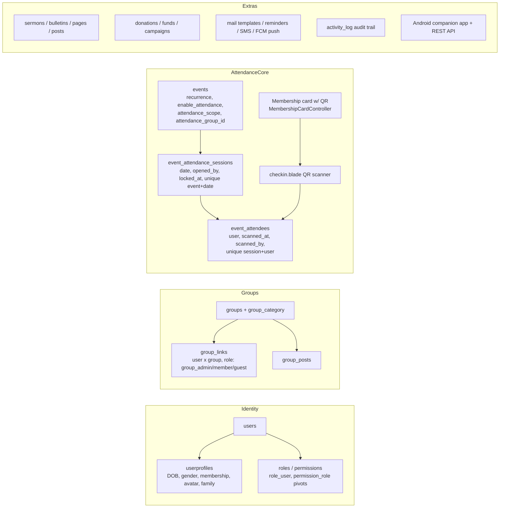

### 3.2 Gap analysis

| Requirement | Baseline status | Work needed |
|---|---|---|
| Member CRUD + self-registration | ✅ users/userprofiles, member portal | Add fields: Chinese name, consent; simplify registration form; Indonesian i18n |
| Member photo for future CV | 🟡 `avatar` only | New `member_photos` + `consents` tables (§4) |
| QR Sunday attendance | ✅ QR membership card + session check-in exists | Add `capture_method`/`mode` to `event_attendees`; per-branch events; mobile polish |
| Branch (TPE/ZL) | ❌ single `church` scope | New `branches` table; `branch_id` on events + home branch on profiles |
| iCare groups | 🟡 groups + group_links (`group_admin` role ≈ leader) | Add "iCare" group category; leader-scoped permissions |
| iCare attendance (leader-recorded, onsite/online, visitors) | ❌ | New leader flow on top of attendance sessions; `mode` + `is_visitor` columns |
| Face recognition (future) | ❌ | Phase 3; schema-ready now via `capture_method`, `member_photos.embedding` |
| Google Calendar birthday sync | 🟡 internal birthday reminders only | New `GoogleCalendarAdapter` + `calendar_links` table porting GAS logic |
| RBAC (admin/leader/volunteer/member) | ✅ roles + permissions tables | Seed the 4 roles; add group-scoped check for leaders |
| Google OAuth login | ❌ (Passport local auth) | Add Laravel Socialite (Google) |
| i18n ID/EN/ZH | ❌ English only | Laravel lang files; ID primary |
| Mobile-first UI | 🟡 responsive admin, Android app | Dedicated mobile-web leader flow (Blade + minimal JS) |
| MySQL | ✅ native | — |
| Audit log | ✅ activity_log | Extend to attendance/consent actions |
| Data export | 🟡 attendance session export exists | Member CSV export command |

**Verdict:** baseline covers ~60% of phase-1 scope, including the hardest part (QR check-in sessions). The main net-new work is branches, iCare attendance flow, Calendar sync, photos/consent, and i18n.

---

## 4. Target Data Model (Normalized ERD)

Reuse baseline tables wherever possible (marked `[base]`); extend with new tables/columns (marked `[new]`). All FKs `ON DELETE` behavior as noted; soft deletes follow baseline convention.

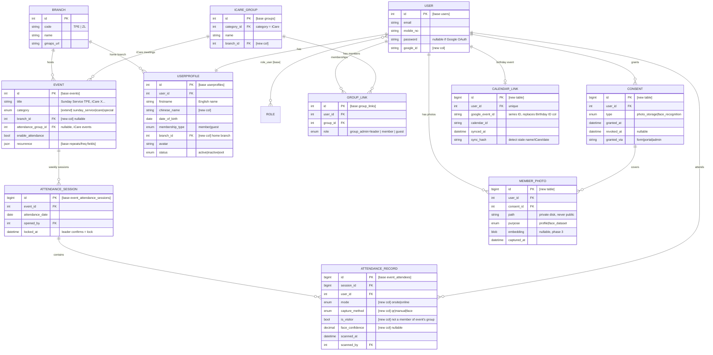

**Normalization notes:**

- **Visitor attendance** needs no extra entity: an `ATTENDANCE_RECORD` whose `user_id` is not in the event's `attendance_group_id` group is a visitor; `is_visitor` is denormalized at write time for cheap reporting (kept consistent by the recording service, not user input).
- **iCare membership** is the `GROUP_LINK` pivot (M:N user↔group), with `role=group_admin` marking the leader — one group can have co-leaders; a member belongs to one iCare by convention (enforced in service layer, not schema, since transfers happen).
- **Roles vs group roles are separate axes:** global `ROLE` (admin/volunteer/member) governs app-wide permissions; `GROUP_LINK.role` scopes leader rights to *their* group only.
- **`capture_method` + `MEMBER_PHOTO.embedding` + `face_confidence`** are the complete schema surface face recognition needs — phase 3 adds code, not columns.
- The baseline `attendances` table (legacy import) is **not used**; all new attendance goes through sessions.

---

## 5. System Design Diagrams (per SOP `research.md`)

Data-model class diagram (ERD) is in §4; this section adds the remaining SOP-required diagrams. MSC shows **component communication**; flowcharts show **algorithm logic**.

### 5.1 Use Case Diagram

| Use case | FR | Phase | Primary actor |
|---|---|---|---|
| UC1 Register & manage own profile | FR-1 | 1 | Member |
| UC2 Sunday QR check-in | FR-2 | 1 | Volunteer |
| UC3 Record iCare attendance | FR-2 | 1 | iCare Leader |
| UC4 Birthday → Google Calendar sync | FR-3 | 2 | System (triggered by UC1/UC5) |
| UC5 Manage members / groups / events | FR-1, FR-4 | 1 | Admin |
| UC6 Reports & absence follow-up | FR-6 | 2 | Admin, iCare Leader |
| UC7 Photo upload & consent management | FR-5 | 1 | Member |
| UC8 Face-recognition capture | FR-7 | 3 | iCare Leader / Volunteer |
| UC9 Data migration import | FR-8 | 1 (one-time) | Admin |

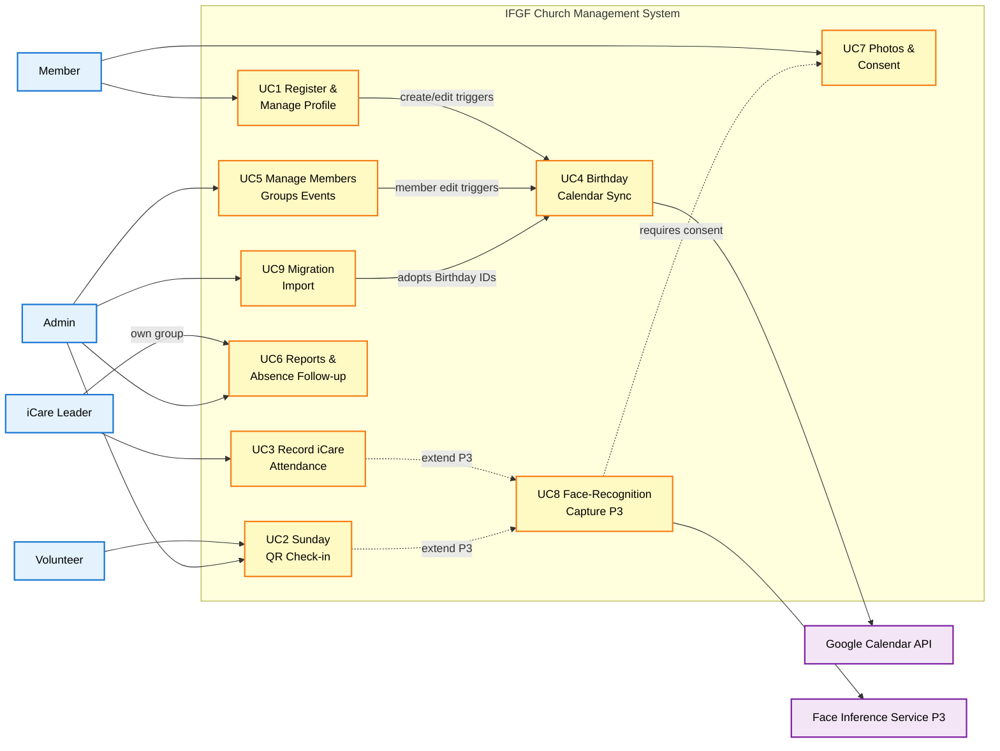

### 5.2 Message Sequence Charts (MSC)

#### UC1: Register & manage profile

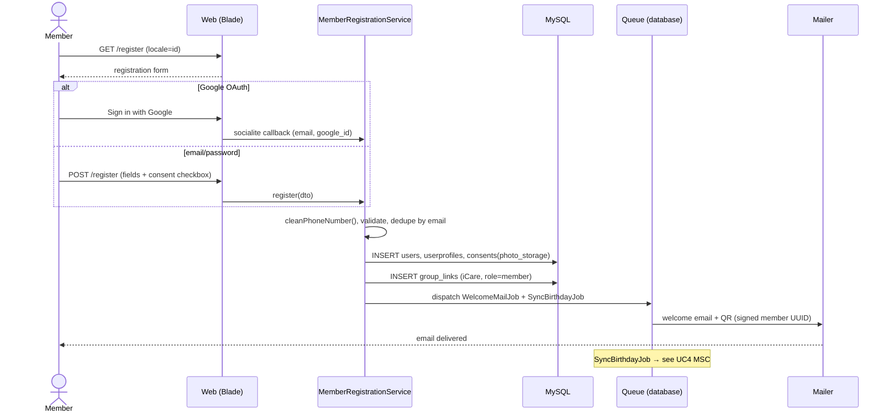

#### UC2: Sunday QR check-in

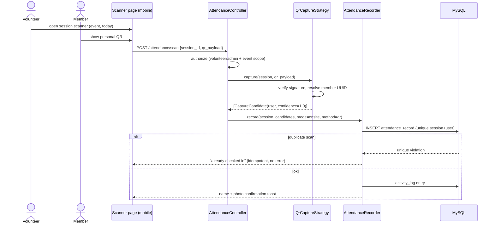

#### UC3: Record iCare attendance (leader, mobile)

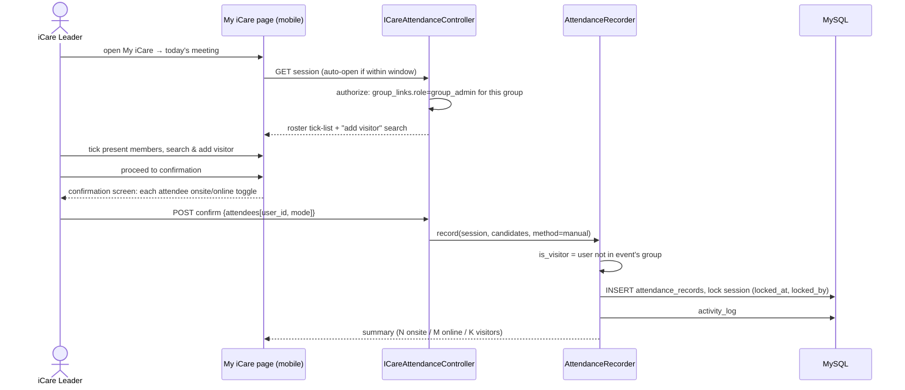

#### UC4: Birthday → Google Calendar sync

```mermaid
sequenceDiagram
    participant J as SyncBirthdayJob (queued)
    participant BS as BirthdaySyncService
    participant CA as GoogleCalendarAdapter
    participant G as Google Calendar API
    participant DB as MySQL

    J->>BS: sync(member)
    BS->>DB: SELECT calendar_links WHERE user_id
    alt no link
        BS->>CA: createRecurringBirthday(member)
        CA->>G: events.insert (yearly all-day series)
        G-->>CA: series id
        CA->>DB: INSERT calendar_links (id, sync_hash)
    else date changed
        BS->>CA: updateRecurrence(link, newDate)
        CA->>G: events.patch (recurrence)
        alt patch fails (ported GAS fallback)
            CA->>G: events.delete + events.insert
            CA->>DB: UPDATE calendar_links.google_event_id
        end
    else name/iCare changed (sync_hash mismatch)
        BS->>CA: updateDetails(link, member)
        CA->>G: events.patch (summary/description)
    else member deleted or status=exit
        BS->>CA: deleteSeries(link)
        CA->>G: events.delete
        CA->>DB: DELETE calendar_links
    end
    Note over J: failure → queue retry w/ backoff; never blocks web request
```

#### UC8: Face-recognition capture (phase 3)

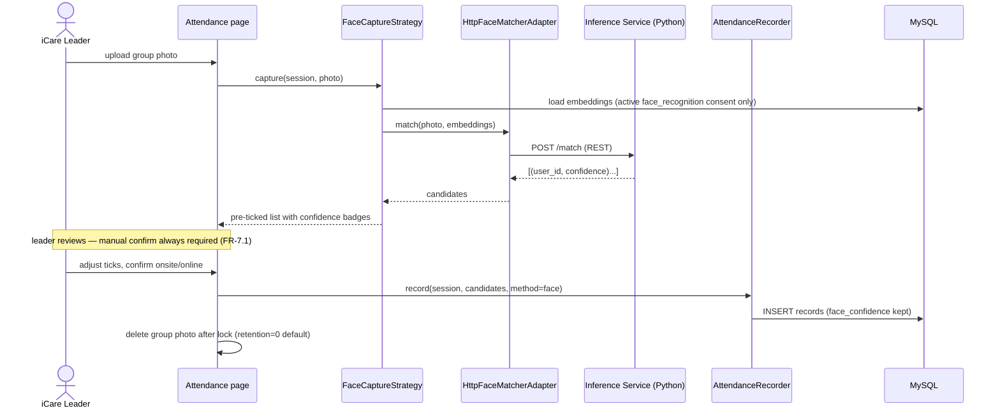

### 5.3 Flowcharts (algorithm logic)

#### UC2: QR scan processing

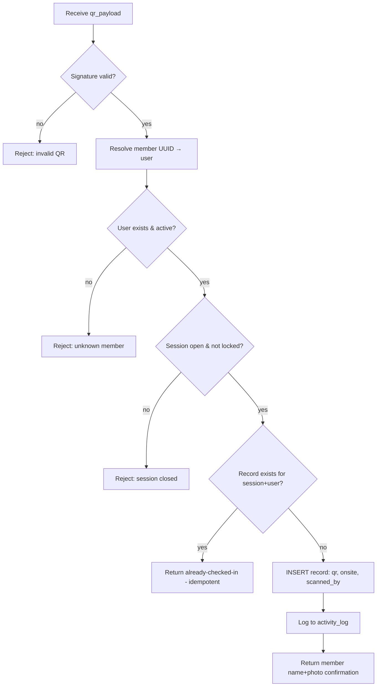

#### UC3: iCare confirmation & visitor logic

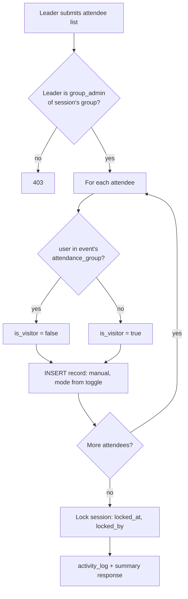

#### UC4: Birthday sync decision (ports GAS `checkAndUpdateBirthdayIfChanged`)

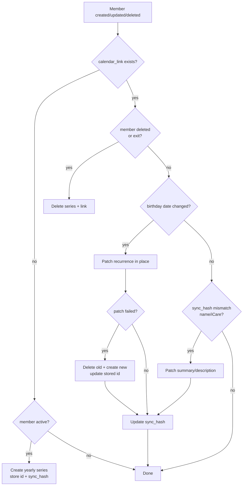

#### UC9: Member import row processing

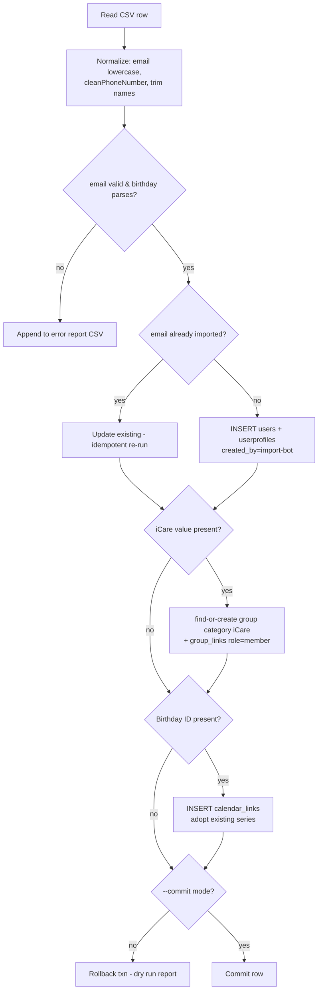

### 5.4 Class Diagram (code-level; data model in §4)

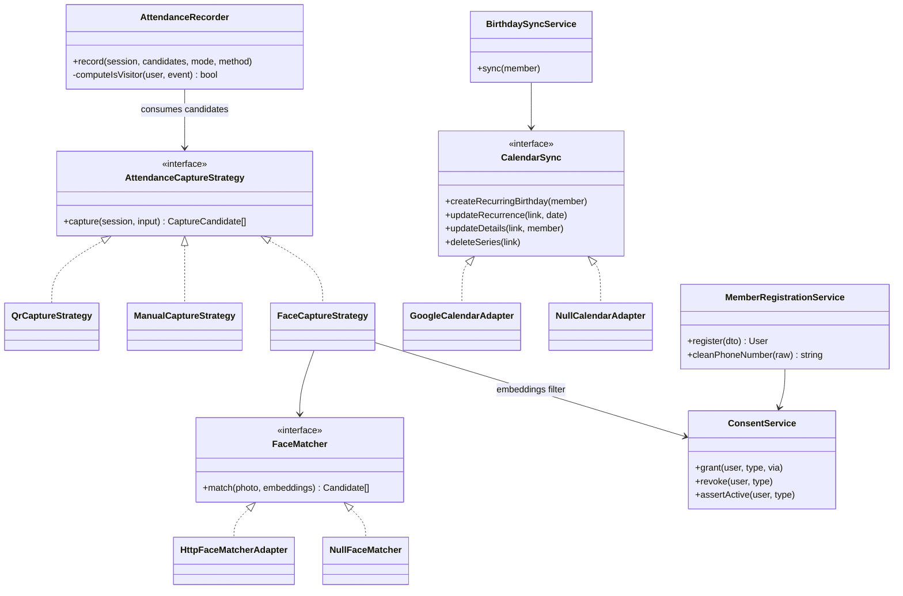

### 5.5 State Machine Diagrams

#### Attendance session lifecycle

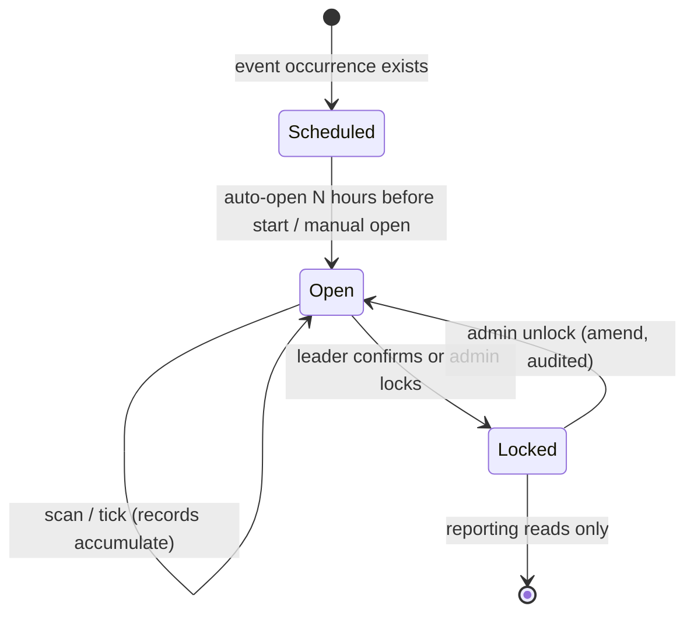

#### Member lifecycle

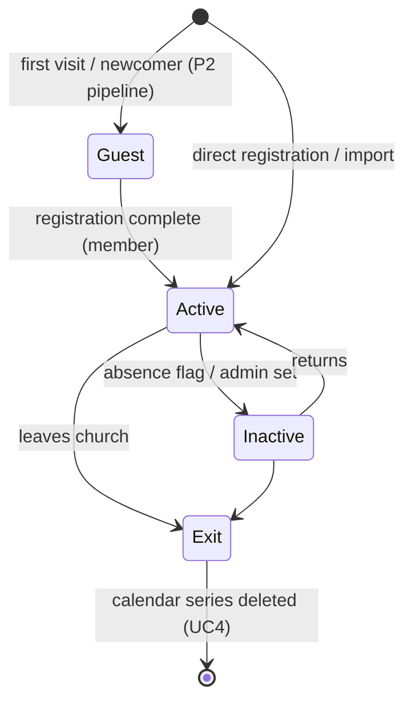

#### Consent lifecycle (per type)

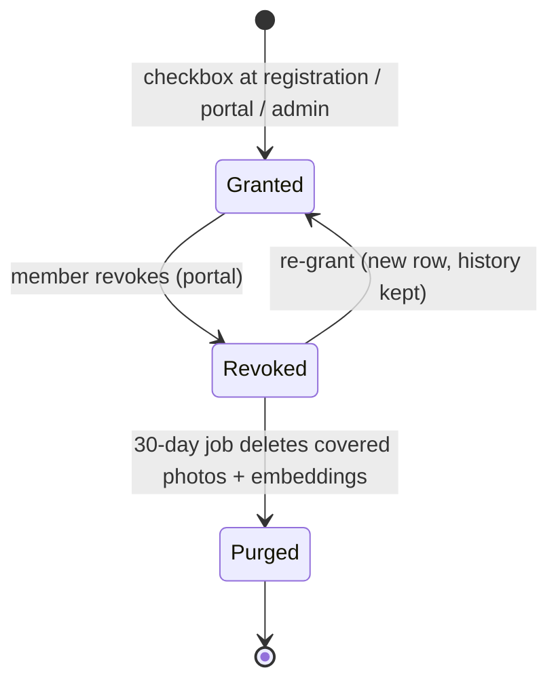

### 5.6 System Parameters

| Parameter | Default | Where | Description |
|---|---|---|---|
| `ATTENDANCE_AUTOOPEN_HOURS` | 2 | `.env`/settings | Session auto-opens N hours before event start (FR-2.2) |
| `ABSENCE_FLAG_WEEKS` | 3 | settings | Consecutive missed Sundays before leader flag (FR-6.2) |
| `QR_SIZE_PX` | 400 | config | Generated QR size (parity with GAS) |
| `PHOTO_RETENTION_DAYS` | 30 | settings | Grace period after consent revocation (FR-5.3) |
| `GROUP_PHOTO_RETENTION_DAYS` | 0 | settings | Group photo kept after session lock (FR-7.2) |
| `GOOGLE_CALENDAR_ID` | — | `.env` | Birthday calendar (FR-3.3) |
| `APP_TIMEZONE` | `Asia/Taipei` | `.env` | All datetimes (N4) |
| `APP_LOCALE` / fallbacks | `id` / `en`, `zh-TW` | `.env` | i18n (N3) |
| `QUEUE_CONNECTION` | `database` | `.env` | Shared-hosting-safe queue (N7) |
| `FACE_MATCH_THRESHOLD` | 0.6 | settings (P3) | Min confidence to pre-tick (FR-7.1) |

---

## 6. Functional Requirements

Priorities: **P0** = phase 1 (members + attendance), **P1** = phase 2, **P2** = phase 3/future.

### FR-1 Member registration & profile — P0

1. Self-service registration page (mobile-friendly, Indonesian default): English name*, Chinese name, birthday*, email*, phone*, iCare (dropdown of active groups), home branch*, photo upload (optional), photo-storage consent checkbox.
2. Google OAuth sign-in (Socialite); email/password fallback. Registration creates `users` + `userprofiles` + role `member`.
3. Welcome email (reuse baseline mail queue) containing the member's permanent QR code (encodes signed member UUID, not a prefill URL).
4. Members edit their own profile after login (replaces GAS edit-URL flow). Admin CRUD via existing admin panel.
5. Phone normalization port from GAS `cleanPhoneNumber` (+886 handling).
6. Duplicate guard: unique email; warn admin on same name+birthday.

### FR-2 Attendance (Sunday + iCare) — P0

1. **Events**: seed recurring events per branch ("Sunday Service TPE/ZL", weekly) and one per iCare group. Baseline recurrence fields suffice.
2. **Sessions**: one `ATTENDANCE_SESSION` per event per date (baseline behavior). Sessions auto-open N hours before event start (config) and lock on confirmation.
3. **Capture is pluggable (Strategy pattern, §8):** `QrCaptureStrategy` (P0), `ManualCaptureStrategy` (P0), `FaceCaptureStrategy` (P2 stub). Each returns candidate `(user_id, confidence)` list; the recording service persists `ATTENDANCE_RECORD`s.
4. **Sunday flow**: volunteer/admin opens scanner page (baseline `checkin.blade`), scans member QRs; each scan writes a record with `capture_method=qr`, `mode=onsite`. Manual search-and-tick fallback on same page.
5. **iCare leader flow (new, mobile-first)**: leader opens "My iCare" → today's session → tick list of group members (+ "add visitor" search across all members) → confirmation screen showing each attendee with onsite/online toggle → confirm locks the session. Records: `capture_method=manual`, `is_visitor` computed. Photo upload slot present but disabled until phase 3 (UI shows "coming soon").
6. **Permissions**: leaders can only record for groups where `group_links.role=group_admin`; volunteers only for Sunday service events; admin everywhere.
7. Late edits: admin (or leader before lock) can amend a session; all changes hit `activity_log`.

### FR-3 Birthday → Google Calendar sync — P1

1. On member create/update/delete, queue `SyncBirthdayJob` → `GoogleCalendarAdapter` (service account, Calendar API):
   - No `CALENDAR_LINK` → create yearly recurring all-day series, store series ID.
   - Date changed → patch recurrence in place; on failure delete + recreate (port GAS fallback logic).
   - Name/iCare changed → patch summary/description only (`sync_hash` compares).
   - Member deleted/`exit` → delete series, remove link.
2. `php artisan calendar:sync-birthdays` = bulk reconcile (ports `syncAllBirthdays`), runnable via scheduler weekly.
3. Calendar ID configurable in `.env`; failures logged + retried via queue, never block the originating request.

### FR-4 Roles & permissions — P0

1. Seed roles: `admin`, `icare_leader`, `volunteer`, `member` on baseline roles/permissions tables; map permissions per FR-2.6.
2. `icare_leader` is granted automatically when `group_links.role=group_admin` is set, revoked when unset.

### FR-5 Photos & consent — P0 schema, P1 collection drive

1. Photo upload (profile + up to 3 face-dataset shots) from member portal or by admin; stored on **private disk** (`storage/app/private`), served via signed URLs only.
2. Upload requires an active `photo_storage` consent; face-dataset purpose additionally requires `face_recognition` consent (separate checkbox, revocable from portal).
3. Revoking consent soft-deletes covered photos within 30 days (scheduled job) and clears embeddings. Consent history is append-only (revoke = new row with `revoked_at`, never hard delete).

### FR-6 Reporting & export — P1

1. Dashboard: weekly attendance trend per branch and per iCare (last 12 weeks), onsite/online split, birthdays this month.
2. Absence flag: members with ≥3 consecutive missed Sunday sessions of their home branch surface on their iCare leader's "My iCare" page.
3. CSV export: members, per-session attendance (baseline export exists — extend columns).

### FR-7 Face recognition — P2 (design-only in this PRD)

1. `FaceCaptureStrategy`: leader uploads group photo → external inference service (separate container, e.g. Python + InsightFace, REST) returns matches against consented embeddings → candidates pre-ticked on the confirmation screen with `face_confidence`; leader always confirms manually before persist.
2. Only members with active `face_recognition` consent participate in matching. Group photos are deleted after the session locks (config retention, default 0 days).
3. Sunday webcam check-in reuses the same strategy against a kiosk camera. No schema changes required.

### FR-8 Data migration from Google Sheets — P0 (see §9)

---

## 7. Non-Functional Requirements

| # | Requirement |
|---|---|
| N1 | Laravel 10 (baseline; upgrade path to 11/12 noted in §10), PHP 8.2+, **MySQL 5.7+/8** — shared-hosting friendly (user requirement) |
| N2 | Mobile-first: leader + check-in flows usable on 360px viewport; Lighthouse mobile ≥ 85 on those pages |
| N3 | i18n: `id` (default), `en`, `zh-TW` lang files for all member/leader-facing pages; admin panel may stay `en` in phase 1 |
| N4 | Self-hostable via baseline installer; timezone `Asia/Taipei`; all secrets in `.env` (SOP §11.5) |
| N5 | Privacy: photos on private disk + signed URLs; consent enforced at upload and at matching; PDPA-aligned retention (FR-5.3) |
| N6 | Auditability: attendance writes, consent changes, member edits → `activity_log` |
| N7 | Availability: queue-based external calls (Calendar, mail, future face service) — third-party outage never blocks check-in |
| N8 | Tests: PHPUnit feature tests for FR-1/2/4 happy paths + permission denials; Dusk smoke for leader flow (baseline test infra) |

---

## 8. Architecture & Patterns (per SOP `programming.md`)

- **Design-first (SOP §1):** this PRD + ERD precede code; each phase gets a short design note in `_ai/` before implementation.
- **Strategy (SOP §3.3)** — attendance capture:

```php
interface AttendanceCaptureStrategy {
    /** @return CaptureCandidate[]  (userId, confidence, capturedAt) */
    public function capture(AttendanceSession $session, CaptureInput $input): array;
}
// QrCaptureStrategy | ManualCaptureStrategy | FaceCaptureStrategy
// AttendanceRecorder (service) validates, computes is_visitor, persists — one call site (SOP §2.4 polymorphism)
```

- **Adapter (SOP §3.1)** — external services behind interfaces so implementations swap without touching core:
  - `CalendarSync` interface → `GoogleCalendarAdapter` (+ `NullCalendarAdapter` for tests/local).
  - `FaceMatcher` interface → `HttpFaceMatcherAdapter` (phase 3) / `NullFaceMatcher`.
- **Service layer:** controllers stay thin; `MemberRegistrationService`, `AttendanceRecorder`, `BirthdaySyncService`, `ConsentService` hold logic. One class per file (SOP §5.1). PHPDoc on all public methods (SOP §4).
- **Suggested improvement over baseline:** baseline controllers are fat and Vue 2 is EOL. Do **not** rewrite existing modules; write all *new* code (iCare flow, capture strategies, sync services) in the service-layer style above with Blade + Alpine.js (no new Vue 2 code), and refactor baseline code only when a task touches it.

### 8.1 SOP `programming.md` Compliance Matrix

How every applicable SOP section is satisfied in this project (O-RAN-specific sections marked N/A):

| SOP § | Rule | Application here |
|---|---|---|
| §1 Design-first | Flowchart → class diagram → state machine → parameters table **before code**; diagrams are a contract | All four artifacts exist in PRD §5 (5.3, 5.4/§4, 5.5, 5.6). **Gate: no phase-1 implementation until this PRD is reviewed and approved; any later change updates PRD and code together** |
| §2.1 Encapsulation | State guarded by its own class | `AttendanceSession` lock state changed only via `AttendanceRecorder`/model methods (`lock()`, `unlock()`), never raw column writes from controllers |
| §2.2 Abstraction | Core depends on interfaces | `CalendarSync`, `FaceMatcher`, `AttendanceCaptureStrategy` interfaces; core services never reference Google/HTTP classes directly |
| §2.3 Inheritance | Shared behavior in base class | Capture strategies share `AbstractCaptureStrategy` (input validation, candidate construction) only if duplication appears — composition preferred |
| §2.4 Polymorphism | One call site, many behaviors | `AttendanceRecorder` consumes any strategy; adding `face` adds a class, edits nothing (§8.2 test: *add a file, never edit one*) |
| §3.1 Adapter | Vendor names stay at the boundary | Google Calendar API fields / face-service JSON never leak past their adapters |
| §3.2 Abstract Factory | Environment selected once at start-up | Laravel service container as factory: `AppServiceProvider` binds `CalendarSync` → `GoogleCalendarAdapter` (prod) or `NullCalendarAdapter` (local/testing) from `.env`, chosen once; same for `FaceMatcher` |
| §3.3 Strategy | One class per algorithm, injected | `AttendanceCaptureStrategy` implementations (FR-2.3) |
| §4 Documentation | Docstrings auto-generatable | PHPDoc (Doxygen-compatible) on every class + public method: `@param`, `@return`, `@throws`, cross-ref FR ID (e.g. `@see PRD.md FR-2.3`). Generated via phpDocumentor to `docs/api/` |
| §5 Folder structure | Tree = architecture; core vs plumbing separated | See §8.2 |
| §5.1 One class per file | One top-level class per file, file named after class | Native in PHP via PSR-4 (enforced by composer autoload); applies to enums (`CaptureMethod`, `AttendanceMode` as PHP 8.1 backed enums, one file each) and exceptions |
| §6 General architecture | Core depends on nothing below it | `app/Core` has no `use` of adapter/HTTP/Eloquent-external classes; verified in code review |
| §7–§10 O-RAN / 3GPP / multi-vendor / IBN | — | N/A (not a RAN project) |
| §11 Production readiness | See checklist | §8.4 |
| §12 Parameter traceability | Every parameter linked to authoritative source | No 3GPP specs here; the equivalent rule: every config parameter appears in §5.6 with FR/NFR reference, in `.env.example` with a comment, and nowhere else hard-coded |

### 8.2 Folder Structure (SOP §5 adapted to Laravel)

New code follows this layout inside the baseline app; baseline modules stay where they are. `Core` holds domain logic and depends on nothing in `Adapters`; adapters depend on core interfaces — never the reverse.

```text
app/
├── Core/                          # research/domain layer — no external-service imports
│   ├── Contracts/                 # one interface per file
│   │   ├── AttendanceCaptureStrategy.php
│   │   ├── CalendarSync.php
│   │   └── FaceMatcher.php
│   ├── Enums/
│   │   ├── AttendanceMode.php     # onsite|online (backed enum)
│   │   ├── CaptureMethod.php      # qr|manual|face
│   │   └── ConsentType.php
│   ├── DTO/
│   │   ├── CaptureCandidate.php
│   │   └── CaptureInput.php
│   └── Services/
│       ├── AttendanceRecorder.php
│       ├── BirthdaySyncService.php
│       ├── ConsentService.php
│       └── MemberRegistrationService.php
├── Adapters/                      # plumbing — depends on Core, never vice-versa
│   ├── Calendar/
│   │   ├── GoogleCalendarAdapter.php
│   │   └── NullCalendarAdapter.php
│   └── Face/
│       ├── HttpFaceMatcherAdapter.php
│       └── NullFaceMatcher.php
├── Strategies/
│   ├── QrCaptureStrategy.php
│   ├── ManualCaptureStrategy.php
│   └── FaceCaptureStrategy.php    # phase 3; NullFaceMatcher until then
├── Http/Controllers/...           # thin — validate, authorize, delegate to Core/Services
└── Console/Commands/
    ├── ImportMembers.php          # ifgf:import-members
    ├── ImportAttendance.php       # ifgf:import-attendance
    └── SyncBirthdays.php          # calendar:sync-birthdays
docs/
├── drawio/                        # any .drawio sources committed here (SOP §5 WARNING); Mermaid lives in this PRD
└── api/                           # generated phpDocumentor output
```

### 8.3 Documentation Standard (SOP §4)

PHPDoc example — the contract the next developer reads before trusting the method:

```php
/**
 * Record attendance candidates into a session.
 *
 * @param AttendanceSession        $session    Open, unlocked session (throws otherwise).
 * @param CaptureCandidate[]       $candidates Resolved by an AttendanceCaptureStrategy.
 * @param AttendanceMode           $mode       Onsite/online, from leader confirmation (PRD FR-2.5).
 * @param CaptureMethod            $method     Persisted per record (PRD §4 ATTENDANCE_RECORD).
 * @return AttendanceSummary                   Counts: onsite/online/visitors.
 * @throws SessionLockedException              If session.locked_at is set.
 * @throws UnauthorizedGroupException          If actor lacks group_admin on the session's group (FR-2.6).
 */
public function record(AttendanceSession $session, array $candidates, AttendanceMode $mode, CaptureMethod $method): AttendanceSummary
```

### 8.4 Production Readiness Checklist (SOP §11 — must pass before phase-1 handover)

| SOP § | Item | This project |
|---|---|---|
| 11.1 | Container image documented & pull-tested | Provide `Dockerfile` + `docker-compose.yml` (app + MySQL) even though shared-hosting deploy is primary; document registry URL if one is used |
| 11.2 | Submodule instructions in README | N/A unless face-inference service is added as a submodule (phase 3 — revisit) |
| 11.3 | Known Issues table in README | Required; seed with: Vue 2 EOL in baseline (ℹ️ INFO), sheet import requires manual CSV export (ℹ️ INFO) |
| 11.4 | API endpoint names identical in diagrams, README, code | Endpoints in §5.2 MSCs (`/attendance/scan`, etc.) are the contract — route names must match; renames get a mapping note in this PRD |
| 11.5 | Every env var in `.env.example`, no secrets committed, expiring credentials marked | All §5.6 parameters + Google service-account path documented in `.env.example`; Google credentials JSON git-ignored; note service-account key rotation procedure |

---

## 9. Data Migration Plan (Google Sheets → MySQL)

**Precondition:** the sheet is not public; export manually as CSV (`File → Download → CSV`) per tab: `Daftar Jemaat`, `Absen-TPE`, `Absen-ZL`.

### 9.1 Member import — `php artisan ifgf:import-members daftar-jemaat.csv --dry-run|--commit`

| Sheet column | Target | Rule |
|---|---|---|
| Timestamp | `users.created_at` | parse `Asia/Taipei` |
| Email Address | `users.email` | lowercase, unique key for dedupe/idempotent re-run |
| Full Name | `userprofiles.firstname` | trim |
| Chinese Name | `userprofiles.chinese_name` | may be empty |
| Tanggal Lahir | `userprofiles.date_of_birth` | parse; **reject row to error report if invalid** |
| iCare | `groups` (find-or-create, category "iCare") + `group_links(role=member)` | trim; empty → no link |
| Phone | `users.mobile_no` | port GAS `cleanPhoneNumber` |
| Birthday ID | `calendar_links.google_event_id` | **preserve** — existing Calendar series adopted, not recreated |
| Edit URL / QR Code URL | discarded | superseded by login + new QR |

Also per row: password `null` + Google-OAuth-or-invite-link activation email; role `member`; `membership_type=member`; branch left `null` (admin assigns; or inferred in 8.2).

### 9.2 Attendance history import (optional, recommended) — `php artisan ifgf:import-attendance absen-tpe.csv --branch=TPE`

- Each weekly column pair in `Absen-TPE`/`Absen-ZL` → one `ATTENDANCE_SESSION` on the "Sunday Service {branch}" event, dated from the column header; ticks → `ATTENDANCE_RECORD(capture_method=manual, mode=onsite)` matched by email/name.
- A member with any attendance in exactly one branch → that branch set as home branch.
- Unmatched names go to an error CSV for manual resolution — **never silently dropped**.

### 9.3 Cutover sequence

1. Freeze GAS form (run `closeRegistrationForm`), final CSV export.
2. `--dry-run` both imports → review error reports → fix → `--commit`.
3. Run `calendar:sync-birthdays` — verifies adopted series; report lists any recreated.
4. Send bulk invite email (activation + new QR attached).
5. Parallel-run one Sunday (old QR form + new system); reconcile counts.
6. Retire GAS triggers; keep spreadsheet read-only as archive.

**Rollback:** GAS system untouched until step 6; abort = delete imported rows (import tags `created_by = import-bot` user).

---

## 10. Phasing & Scope

| Phase | Scope | Out |
|---|---|---|
| **1 (MVP)** | FR-1, FR-2, FR-4, FR-5 schema+upload, FR-8; i18n `id`; Google OAuth | Calendar sync (GAS birthday flow keeps running vs the old sheet until phase 2 — or run `syncAllBirthdays` manually) |
| **2** | FR-3, FR-6, FR-5 photo drive; `en`/`zh-TW`; LINE notify (replace email where possible) | — |
| **3** | FR-7 face recognition (iCare photo first, then Sunday webcam); kiosk mode | — |
| Future | Newcomer pipeline, family/household, offline-tolerant PWA queue, Laravel 11/12 + Vue-2 retirement | — |

**Explicitly out of scope (all phases):** donations/funds, sermons/CMS website, Android app changes — baseline modules left as-is (may be enabled later for free).

---

## 11. Open Questions

1. Confirm exact `Daftar Jemaat` header names against the real CSV before writing the importer (sheet not machine-readable at PRD time).
2. One `church` row with a `branches` table (assumed here) vs two church rows — assumed single-church because members/iCares span branches.
3. LINE Messaging API account availability for phase 2 (needs an official account).
4. Where to host (shared hosting vs VPS) — affects queue driver choice (`database` assumed, works on shared hosting).
5. Face-recognition inference hosting (phase 3): church-owned PC vs cloud GPU — decide at phase-3 design.

