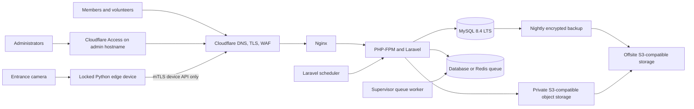

# Hosting and Self-Hosting Plan

**Date checked:** 2026-08-08

**Application:** IFGF Church Member and Activity Management

**Required stack:** Laravel 13, a compatible supported PHP 8.3 through 8.5 release, MySQL 8.4 LTS, Composer 2, reproducible frontend build, queue worker, scheduler, private file storage, HTTPS

Prices and packages change. Verify the linked provider page immediately before purchase.

## Recommendation

Use an Indonesian commercial Cloud VPS with at least 2 vCPU, 2 GB RAM, and 30 GB NVMe for a pilot only. Treat 4 GB RAM as the initial production candidate for Laravel, MySQL, and queue workloads. Store production profile and attendance images in a private S3-compatible object store rather than the VPS filesystem. Production approval requires the load, storage, privacy, and recovery gates below. Put Cloudflare DNS, proxy, WAF, and rate limiting in front of the public member hostname. Use a separate admin hostname protected by Cloudflare Access where operationally acceptable.

Do not run live-camera inference on the application VPS. Phase 2 live recognition runs on a separately secured Python edge device at the church entrance. Laravel remains the sole attendance writer and exposes only a versioned device API.

## Option comparison

| Option | Approximate current entry point | Benefits | Constraints | Fit |
|---|---:|---|---|---|
| DomaiNesia Cloud VPS Lite 2 GB | Rp100,000 per month | Indonesian provider, 2 CPU, 30 GB NVMe, dedicated IP, full root access | Unmanaged; church owns security, backup, and monitoring | Strong low-cost pilot |
| IDCloudHost Cloud VPS | From about Rp87,000 per month for the displayed basic profile | Indonesia and Singapore choices, Laravel app catalog, flexible scaling, object storage options | Displayed price is a simulation; confirm final specification | Strong alternative |
| Indonesian shared or cloud hosting | Varies | Control panel, email, PHP 8, MySQL, SSH, Git, Composer on supported plans | Long-running queue workers, Supervisor, WebSockets, Docker, and custom services may be restricted | Pilot only after provider confirms requirements |
| Managed VPS | DomaiNesia displayed from Rp985,500 per month for 2 GB | cPanel, managed environment, security tooling, migration help | Much higher cost; confirm exact management scope and backup SLA | Best when no sysadmin is available |
| Church-owned server with Cloudflare Tunnel | Existing hardware plus Internet and backup cost | No public IP required, no inbound ports, full control | Power, Internet, hardware, patching, and offsite backup become church responsibilities | Viable secondary option |

Official provider references:

- DomaiNesia Cloud VPS Lite: https://www.domainesia.com/cloud-vps-lite/
- DomaiNesia managed VPS: https://www.domainesia.com/managed-vps/
- IDCloudHost Cloud VPS: https://idcloudhost.com/cloud-vps/
- IDCloudHost hosting capabilities: https://idcloudhost.com/hosting/
- DomaiNesia hosting features: https://www.domainesia.com/hosting/
- Rumahweb cloud hosting: https://www.rumahweb.com/cloud-hosting/
- Dewaweb application hosting consultation: https://www.dewaweb.com/submitticket.php?deptid=14&step=2

## Why VPS is preferred over shared hosting

This application requires background birthday synchronization, email delivery, report exports, occurrence generation, media cleanup, and future Zoom or image processing. Laravel queue workers are long-running processes and must be restarted during deployment. A VPS can run Supervisor or an equivalent process manager, while shared hosting often limits persistent workers.

Shared hosting is acceptable only if the provider confirms all of the following in writing:

1. The PHP version required by the selected security-supported Laravel release and all required extensions.
2. MySQL 8.4 LTS and `utf8mb4`. MySQL 8.0 is no longer a production target.
3. SSH, Git, and Composer 2.
4. Document root can point to Laravel `public/`.
5. Cron can run Laravel scheduler every minute.
6. A supported queue-worker mechanism exists.
7. Private storage is outside the public document root.
8. CLI memory and execution limits support imports and exports.
9. Automated backups include database and private files.

If any item is unavailable, choose a VPS.

## Data-center location

The users are primarily in Taiwan, while the requested hosting vendors are Indonesian. Test both Jakarta and Singapore regions from the church network and representative mobile connections. An Indonesian vendor with a Singapore region may provide lower latency to Taiwan while keeping Indonesian billing and support.

Select the region only after measuring:

1. Median and p95 HTTPS latency from Taipei and Zhongli.
2. Packet loss during Sunday service hours.
3. Upload speed for group photos and report imports.
4. Provider support response and backup options.
5. Legal and organizational data-location requirements.

Before using Indonesian or Singapore infrastructure for Taiwanese member data, document the controller and processor roles, transfer basis, provider agreements, backup regions, log destinations, retention, deletion, subject-access process, and incident contacts. This gate applies to all personal data, not only photos or biometrics.

## Recommended production topology

## Private media and object storage

Production media storage uses private S3-compatible object storage with no anonymous bucket access, public object URL, or member-photo CDN cache. MySQL stores the media owner, purpose, object key, checksum, MIME type, pixel dimensions, state, consent reference, uploader, retention class, and deletion state. It does not store base64 image data or normal profile-image bytes.

The current upstream application's generic upload trait and S3 configuration are public-storage oriented. New IFGF member media must use package-owned logical disks such as `ifgf_media_quarantine` and `ifgf_media_private`, both configured private. Do not route sensitive media through the upstream public upload helper. Treat `userprofiles.avatar` as a compatibility projection only; the IFGF media row is authoritative, and any upstream accessor change requires a compatibility-ledger entry and characterization tests.

Uploads use short-lived presigned grants into a quarantine prefix or bucket. A server-side job verifies the claimed owner and upload token, enforces byte and pixel limits, decodes the image rather than trusting the extension, rejects malformed or unsupported content, removes EXIF and other metadata, checks malware where supported, generates sanitized WebP display variants at 256 and 512 pixels plus a JPEG fallback, and moves only accepted outputs into the clean private prefix. Object keys are random and contain no member name, email, phone, birthday, or database identifier. Downloads are authorization checked and short-lived; ordinary member photos are never made public merely to simplify rendering.

Profile-display media, biometric enrollment media, iCare documentation photos, and temporary diagnostics use separate purposes, access rules, and lifecycle policies. Biometric templates are encrypted binary records in MySQL with a dedicated key-encryption key; they are not object-store thumbnails. Enrollment source media is purged after template verification unless an approved retention policy states otherwise. Routine webcam frames are never uploaded. Production diagnostic crops are disabled unless a time-boxed incident process enables a maximum 24-hour lifecycle.

The provider must support private buckets, presigned operations, encryption, audit logs, object lifecycle deletion, versioning behavior that honors deletion policy, export portability, restore testing, and an approved primary and backup region. Cloudflare R2 is S3-compatible, but its Asia-Pacific location hint is best-effort and does not guarantee Indonesian or Taiwanese residency. R2 is therefore a technical candidate, not an automatic privacy approval. The same region and processor review applies to every replica and backup.

References:

- Amazon S3 presigned URLs: https://docs.aws.amazon.com/AmazonS3/latest/userguide/using-presigned-url.html
- Cloudflare R2 S3 compatibility: https://developers.cloudflare.com/r2/api/s3/api/
- Cloudflare R2 data location: https://developers.cloudflare.com/r2/reference/data-location/

## Entrance recognition appliance

The recognition appliance is separate from the web host. The initial performance profile is an x86-64 mini PC with at least four modern CPU cores, 16 GB RAM, a 256 GB SSD, hardware-backed key storage where supported, secure boot, full-disk encryption, wired Ethernet, and a small UPS. Start with a 1080p WDR camera mounted for a stable frontal entrance view. Plain RGB is acceptable for shadow and assisted trials; automatic mode requires measured presentation-attack performance, and an infrared or depth-capable camera is preferred if RGB alone cannot pass the approved gate. Select the exact CPU, accelerator, and camera only after benchmarking the pinned models on representative lighting, glasses, masks, motion, and entrance density.

Run a supported Linux LTS release with a dedicated unprivileged service account, automatic security updates under a maintenance policy, outbound-only firewall rules, no general web browsing, and no inbound Internet exposure. Package the Python application as a reproducible virtual environment or container after comparing startup, device access, and inference performance. Pin OpenCV or the chosen camera layer, ONNX Runtime execution provider, detector, embedding model, liveness model, preprocessing, thresholds, checksums, and licenses. Releases and configuration are signed and remotely revocable.

The local store contains only consented identity references, encrypted templates required for the assigned location, signed configuration, and an encrypted idempotent outbox. It does not contain profile originals. A device cache older than 24 hours cannot make automatic decisions. Consent withdrawal, template replacement, or device revocation publishes a tombstone that the device acknowledges. If the network, camera, liveness checks, clock, disk encryption, model signature, or health gate fails, the device downgrades to assisted or no-recognition mode and volunteers use QR or manual attendance.

Monitor heartbeat age, software and model version, certificate expiry, clock drift, cache revision, tombstone acknowledgement, camera availability, inference latency, no-match and ambiguity rates, liveness failures, outbox age, disk state, and thermal or accelerator health. Keep named recognition telemetry restricted to the minimum retention window; use aggregate operational metrics where identity is unnecessary.

### Minimum pilot profile

- 2 vCPU
- 2 GB RAM
- 30 GB NVMe
- Ubuntu 24.04 LTS or another provider-supported LTS
- Nginx, the approved PHP 8.3 through 8.5 FPM version, MySQL 8.4 LTS
- Database-backed queue
- One queue worker
- Nightly offsite backup

### Recommended production profile

- 2 vCPU or more
- 4 GB RAM
- 60 GB NVMe or more
- Redis for cache and queue when operational skill permits
- Separate daily database and object-metadata backups plus provider-appropriate protected media replication
- Provider snapshots plus independent offsite backup
- Uptime, disk, queue, scheduler, certificate, and backup monitoring

Storage sizing must be recalculated after measuring the real workbook export, database export, profile photos, group photos, variants, object versions, deletion behavior, and retention policy. The VPS does not need to hold the production media corpus, but it still needs temporary quarantine and processing headroom with a hard cleanup limit.

The production profile remains provisional until a staging benchmark passes both a normal Sunday scenario and an annual-event burst. Record peak and p95 CPU, RAM, disk latency, database connections, HTTP latency, queue age, failed jobs, upload time, and storage growth. The operational runbook must define provider-specific vertical scaling and rollback steps before launch.

Initial alert and scaling review thresholds are sustained CPU above 70%, RAM above 80%, disk above 75%, p95 authenticated response above 2 seconds, queue age above 60 seconds, or database connections above 70% of the configured limit. Tune these thresholds from measured results rather than treating them as permanent constants.

Test web and proxy upload limits with the approved maximum group-photo size and a realistic concurrent import. Forecast database, original-media, derivative, log, and backup growth for the entire retention window plus 30% headroom.

## Cloudflare usage

### Commercial VPS

Use Cloudflare for public DNS, TLS proxy, WAF rules, rate limiting, and DDoS mitigation. Restrict the origin firewall to required administration paths and Cloudflare traffic where practical. Keep MySQL private.

Use separate hostnames:

- `members.example.org` for public registration and member access.
- `admin.example.org` for administration and leader access.

Cloudflare Access can protect the admin hostname with identity policies. Laravel authorization remains mandatory because Access is an additional boundary, not a replacement.

### Home server

Cloudflare Tunnel creates outbound-only connections and does not require a public IP or open inbound ports. It is appropriate when the church deliberately accepts local power and Internet risk.

Home-server requirements:

1. UPS sized for the server, router, and modem.
2. Automatic restart after power recovery.
3. Two independent Internet paths for important event days where feasible.
4. Offsite encrypted database and media backup.
5. External uptime monitor.
6. Documented hardware replacement plan.
7. At least two `cloudflared` replicas only when they terminate on independent reliable hosts.

Cloudflare references:

- Tunnel overview: https://developers.cloudflare.com/tunnel/
- Self-hosted application protection: https://developers.cloudflare.com/cloudflare-one/access-controls/applications/http-apps/self-hosted-public-app/

## Deployment method

Choose one method and keep it reproducible.

### Conventional VPS

Use Nginx, PHP-FPM, MySQL, Supervisor, and cron managed by the operating system. Deploy releases into versioned directories and switch a symlink after migrations and cache warm-up. This has the lowest memory overhead.

### Docker Compose

Use app, web, database, queue-worker, scheduler, and optional `cloudflared` services. Pin image versions, use named volumes, and test restore procedures. Docker is convenient for portability but uses additional memory.

For a 2 GB VPS, conventional deployment is preferred. Docker Compose is reasonable from 4 GB after measuring memory.

Laravel deployment reference: https://laravel.com/docs/13.x/deployment

MySQL 8.0 reached end of life in April 2026. Use MySQL 8.4 LTS for staging and production and run compatibility checks against anonymized legacy data before cutover.

- MySQL 8.0 end-of-life notice: https://www.mysql.com/support/eol-notice.html
- MySQL 8.4 LTS release model: https://dev.mysql.com/doc/refman/8.4/en/mysql-releases.html

## Production branch and release automation

`deploy` is the only production release branch. Protect it from direct development and force pushes, restrict push access, require CI, require approval on the production environment, and allow only a linear promotion of an exact staging-tested commit from `ifgf/main`. A normal push to `origin/deploy` may trigger production automation only after the Phase 1E release authorization.

Build one immutable release artifact from the `deploy` commit. Pin Composer and npm dependencies with committed lockfiles, record the PHP and Node versions, avoid mutable container tags, and include the application commit, PRD version, schema version, and asset hash in the release manifest. The server must not run dependency updates against open version ranges during deployment.

Use a single active deployment lock. Take and verify the required backup before migrations, deploy to a versioned release directory or immutable container, run approved forward migrations, rebuild Laravel caches, restart queue workers gracefully, switch traffic only after health checks, and retain the last verified release for application rollback. A code rollback does not automatically reverse a database migration; the migration contract and recovery runbook govern database recovery.

## Deployment checklist

1. Create non-root deploy user and disable password SSH login.
2. Configure firewall and automatic security updates.
3. Install supported PHP, MySQL, Composer, and Node build tooling.
4. Create least-privilege database user bound to localhost.
5. Set document root to `public/`.
6. Install application with production dependencies.
7. Set `APP_ENV=production`, `APP_DEBUG=false`, URL, timezone, mail, queue, and calendar configuration.
8. Run migrations after a fresh backup.
9. Cache configuration, routes, events, and views.
10. Start and monitor queue workers through Supervisor.
11. Run Laravel scheduler every minute.
12. Configure private storage and expiring download routes.
13. Configure Cloudflare DNS, TLS, WAF, and admin Access policy.
14. Configure encrypted nightly offsite backups.
15. Test registration, QR, email, Calendar, iCare, CGSL, Zoom import, and exports.
16. Run a restore drill before production cutover.
17. Verify quarantine, image sanitization, private variants, signed expiry, object lifecycle, deletion, and restore behavior.
18. Pair and assign each edge device through the administrator workflow; verify certificate rotation, revocation, signed configuration, stale-cache refusal, and QR fallback before enabling a pilot.
19. Protect `deploy`, configure the production-environment approval, restrict deployment credentials, and test the release workflow with a non-production target.
20. Verify the release manifest, immutable artifact hash, deployment lock, health checks, previous-release rollback, and failed-migration recovery before the first production push.

## Backup and recovery

Backups must include:

1. MySQL logical dump or provider-consistent database backup.
2. Private profile and attendance media.
3. Environment configuration encrypted separately.
4. Google service-account configuration or OAuth refresh credentials through a secure secret process.
5. A manifest containing application commit, schema version, and backup timestamp.
6. `APP_KEY`, application encryption keys, QR signing keys, and key-version metadata through a recoverable secret-management process.
7. The biometric key-encryption key, device certificate authority and revocation state, active device credentials, threshold profiles, signed model manifest, and model rollback artifacts through the approved secret and artifact processes.

Retention baseline:

- Daily backups for 14 days.
- Weekly backups for 8 weeks.
- Monthly backups for 12 months.
- At least one copy outside the hosting provider.

Every quarter, restore into an isolated environment and verify member count, recent attendance, private-media access, deletion state, application login, key recovery, device revocation state, and the ability to rebuild a clean edge device without restoring revoked templates or expired diagnostic media.

## Monitoring and operations

Alert on:

1. Public and admin hostname availability.
2. HTTP 5xx rate.
3. Disk usage above 75% and 90%.
4. MySQL connection or storage errors.
5. Failed jobs and queue age.
6. Scheduler heartbeat.
7. Failed Calendar synchronization.
8. Backup age and restore-test status.
9. TLS certificate or Cloudflare Tunnel health.
10. CPU, RAM, disk latency, database connection saturation, reverse-proxy rejection, and upload failures.
11. Object-store quarantine age, variant failures, lifecycle deletion failures, unexpected public access, and signed-access anomalies.
12. Edge heartbeat, certificate expiry, clock drift, camera state, model and configuration revision, cache staleness, tombstone acknowledgement, inference latency, ambiguity rate, liveness failures, and outbox age.

Before major Sunday or annual events, verify monitoring, available disk, backup freshness, QR camera permissions, and manual fallback.

## Final provider selection scorecard

Score each candidate from 1 to 5.

| Criterion | Weight |
|---|---:|
| Measured latency and stability from Taiwan | 20% |
| Queue and scheduler support | 15% |
| Backup and restore capability | 15% |
| Security ownership and managed-service scope | 15% |
| MySQL 8 and approved PHP-version support | 10% |
| Storage and scaling | 10% |
| Support response quality | 10% |
| Total recurring cost | 5% |

Select the highest weighted score that has an identified operational owner. The cheapest server without an owner for patching and recovery is not production-ready.
